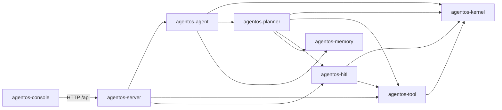

# AgentOS

AgentOS 是一个基于 Java 21、Maven 与 Spring Boot 的多模块 Agent 运行时骨架。各领域模块保持为纯 Java，Spring 只负责在 `agentos-server` 中完成装配和对外服务。

## 模块与依赖



- [`agentos-kernel`](agentos-kernel/ReadMe.md)：运行入口、Agent 循环、上下文与状态机。
- [`agentos-agent`](agentos-agent/ReadMe.md)：主 Agent 编排，连接规划、执行和记忆。
- [`agentos-planner`](agentos-planner/ReadMe.md)：任务规划、计划模型和顺序执行器。
- [`agentos-tool`](agentos-tool/ReadMe.md)：工具协议、注册表、执行器及内置 `echo` 工具。
- [`agentos-memory`](agentos-memory/ReadMe.md)：有界短期记忆、长期记忆适配器和统一服务。
- [`agentos-hitl`](agentos-hitl/ReadMe.md)：风险策略与人工审批端口；默认拒绝需要审批的操作。
- [`agentos-console`](agentos-console/ReadMe.md)：基于 Vue 3 的独立 Agent 操作控制台。
- [`agentos-server`](agentos-server/ReadMe.md)：Spring Boot 依赖注入、REST API 与集成测试。

## 启动

```bash
mvn clean test
mvn -pl agentos-server -am spring-boot:run -Dspring-boot.run.profiles=demo
```

`demo` Profile 使用不调用模型的 `DemoTaskPlanner`。非 `demo` 环境默认启用
`LlmTaskPlanner`，启动前必须提供一个具体的 `ModelClient` Bean。

运行一次 Agent：

```bash
curl -X POST http://localhost:8080/api/agents/runs \
  -H "Content-Type: application/json" \
  -d '{"sessionId":"demo","input":"hello agentos"}'
```

查询会话状态：

```bash
curl http://localhost:8080/api/agents/demo/state
```

启动独立 Vue 3 控制台：

```bash
cd agentos-console
npm install
npm run dev
```

浏览器访问 `http://localhost:5173`，Vite 会将 `/api` 请求代理到本地 `agentos-server`。

当前内存型 `LongMemory` 是可替换的演示适配器，后续可以接入数据库或向量存储实现。
