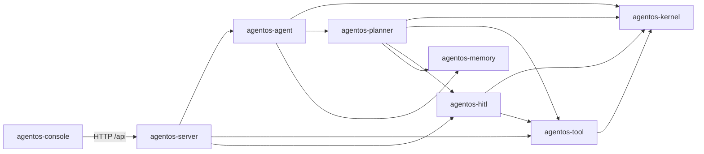

# AgentOS

AgentOS 是一个基于 Java 21、Maven 与 Spring Boot 的多模块 Agent 运行时骨架。各领域模块保持为纯 Java，Spring 只负责在 `agentos-server` 中完成装配和对外服务。

## 模块与依赖



- [`agentos-kernel`](agentos-kernel/ReadMe.md)：运行入口、Agent 循环、上下文与状态机。
- [`agentos-agent`](agentos-agent/ReadMe.md)：主 Agent 编排，连接规划、执行和记忆。
- [`agentos-planner`](agentos-planner/ReadMe.md)：迭代规划、失败分类、计划模型和执行器。
- [`agentos-tool`](agentos-tool/ReadMe.md)：工具协议、结构化失败以及文件探索工具。
- [`agentos-memory`](agentos-memory/ReadMe.md)：有界短期记忆、长期记忆适配器和统一服务。
- [`agentos-hitl`](agentos-hitl/ReadMe.md)：风险策略与人工审批端口；默认拒绝需要审批的操作。
- [`agentos-console`](agentos-console/ReadMe.md)：基于 Vue 3 的独立 Agent 操作控制台。
- [`agentos-server`](agentos-server/ReadMe.md)：Spring Boot 依赖注入、REST API 与集成测试。

## 启动

```bash
mvn clean test
mvn -pl agentos-server -am spring-boot:run
```

应用默认启用 `LlmAgentPlanner` 和 OpenAI-compatible `ModelClient`。模型参数统一配置在
[`application.yml`](agentos-server/src/main/resources/application.yml) 中，也可以使用环境变量覆盖：

```powershell
$env:AGENTOS_MODEL_API_KEY = "your-api-key"
mvn -pl agentos-server -am spring-boot:run
```

完整的模型配置和兼容模式参见 [`agentos-server`](agentos-server/ReadMe.md)。

运行一次 Agent：

```bash
curl -X POST http://localhost:8080/api/agents/runs \
  -H "Content-Type: application/json" \
  -d '{"sessionId":"session-1","input":"hello agentos"}'
```

实时查看规划、工具、Observation 和 Decision：

```bash
curl -N -X POST http://localhost:8080/api/agents/runs/stream \
  -H "Content-Type: application/json" \
  -H "Accept: text/event-stream" \
  -d '{"sessionId":"session-1","input":"hello agentos"}'
```

查询会话状态：

```bash
curl http://localhost:8080/api/agents/session-1/state
```

启动独立 Vue 3 控制台：

```bash
cd agentos-console
npm install
npm run dev
```

浏览器访问 `http://localhost:5173`，Vite 会将 `/api` 请求代理到本地 `agentos-server`。

默认记忆模式使用本地文件持久化；测试可切换为 JVM 内存模式，生产环境仍建议接入数据库或向量存储。


外部工具
天气
股票
搜索
地图
邮件
日历
数据库
本地工具
文件
Shell
Git
代码执行
浏览器
