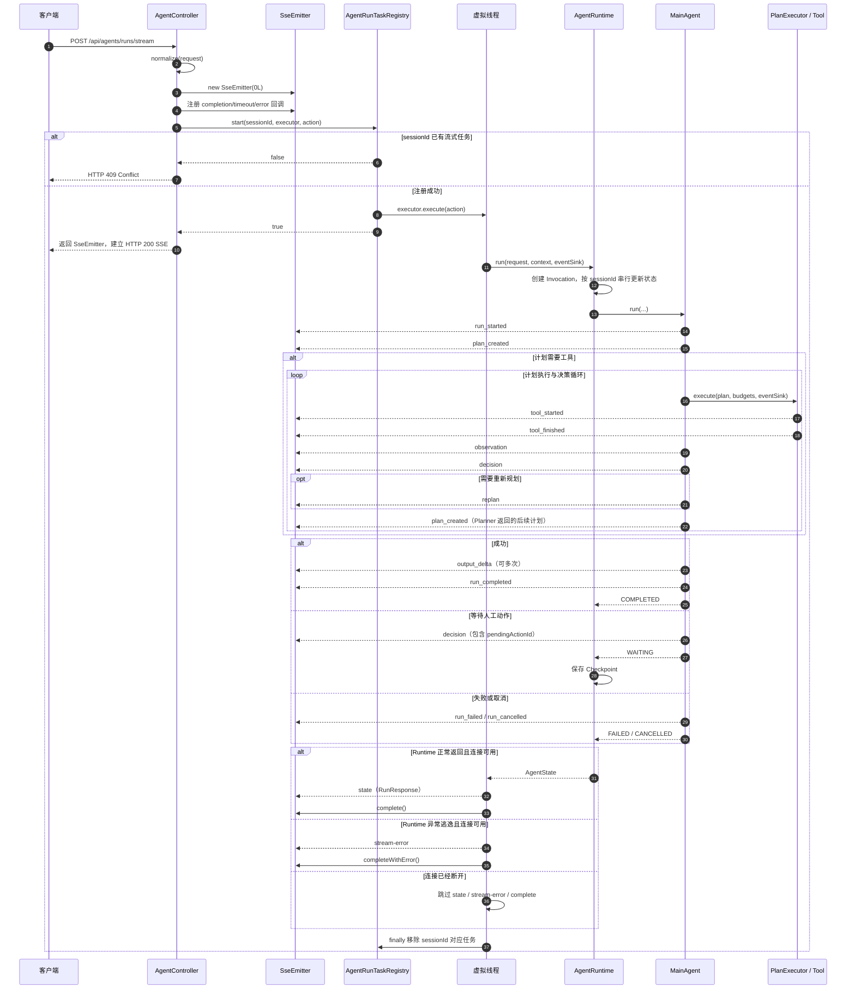

# AgentController `/runs/stream` 执行流程

本文梳理 `AgentController` 中以下接口从接收 HTTP 请求到关闭 SSE 连接的完整执行流程：

```java
@PostMapping(value = "/runs/stream", produces = MediaType.TEXT_EVENT_STREAM_VALUE)
public SseEmitter stream(@RequestBody RunRequest request)
```

接口完整路径为：

```text
POST /api/agents/runs/stream
```

相关核心代码：

- [`AgentController`](../agentos-server/src/main/java/com/github/agentos/server/controller/AgentController.java)
- [`AgentRunTaskRegistry`](../agentos-server/src/main/java/com/github/agentos/server/registry/AgentRunTaskRegistry.java)
- [`AgentRuntime`](../agentos-kernel/src/main/java/com/github/agentos/kernel/AgentRuntime.java)
- [`MainAgent`](../agentos-agent/src/main/java/com/github/agentos/agent/MainAgent.java)
- [`PlanExecutor`](../agentos-planner/src/main/java/com/github/agentos/planner/PlanExecutor.java)
- [`AgentRunEvent`](../agentos-kernel/src/main/java/com/github/agentos/kernel/AgentRunEvent.java)

## 1. 接口职责

该接口负责启动一次 Agent 运行，并通过 SSE 持续向客户端发送运行阶段事件。它主要承担四项职责：

1. 校验并规范化请求参数；
2. 创建和管理 SSE 连接；
3. 将 Agent 任务提交到独立虚拟线程，并限制同一 `sessionId` 只能有一个流式任务；
4. 将 Agent 内部事件转换为 SSE 命名事件；正常返回且连接可用时，最后发送统一的 `state` 事件并关闭连接。

该接口同时输出 Agent 运行阶段事件和最终回答增量。规划模型仍然返回并校验完整的结构化 JSON；进入完成阶段后，`ModelStreamingAgentFinalizer` 调用文本模型的 SSE 接口，上游每个可见增量会立即变成一个 `output_delta`，不等待完整回答，也不做定长二次切片。短路回答或工具执行结果不是模型 token，会作为单个确定性 `output_delta` 返回。

## 2. 请求参数规范化

请求体类型为 `AgentController.RunRequest`：

| 字段 | 必填 | 默认值 | 用途 |
| --- | --- | --- | --- |
| `teamId` | 否 | `default-team` | 团队作用域 |
| `userId` | 否 | `default-user` | 用户作用域 |
| `agentId` | 否 | `main-agent` | Agent 标识 |
| `sessionId` | 否 | 随机 UUID | 会话标识，也是流式任务注册键 |
| `taskId` | 否 | 空字符串 | 任务标识 |
| `input` | 是 | 无 | 用户目标；不能为 `null`、空串或纯空白 |
| `attributes` | 否 | 空 Map | 请求扩展属性 |

其中 `teamId`、`userId`、`agentId` 和 `sessionId` 在值为 `null`、空串或纯空白时使用默认值；`taskId` 只有在值为 `null` 时才转换为空字符串；`attributes` 为 `null` 时转换为空 Map。缺少请求体或 JSON 格式错误通常由 Spring MVC 在进入 `stream()` 前直接拒绝，不经过 `normalize()`。

`normalize()` 将请求拆成两个内核对象：

```text
RunRequest
├── AgentRequest(sessionId, input, attributes)
└── AgentContext(teamId, userId, agentId, taskId)
```

如果 `input` 无效，`normalize()` 抛出 `IllegalArgumentException`，再由 `AgentExceptionHandler` 转换为 HTTP 400 Problem Detail。此时异步处理和 SSE 连接都还没有启动。

请求示例：

```bash
curl -N -X POST http://localhost:8080/api/agents/runs/stream \
  -H 'Content-Type: application/json' \
  -H 'Accept: text/event-stream' \
  -d '{
    "teamId": "team-1",
    "userId": "user-1",
    "agentId": "main-agent",
    "sessionId": "session-1",
    "taskId": "task-1",
    "input": "查询今天的天气并给出出行建议",
    "attributes": {}
  }'
```

## 3. 总体时序



## 4. 分阶段执行流程

### 4.1 创建 SSE 连接

Controller 创建：

```java
SseEmitter emitter = new SseEmitter(0L);
AtomicBoolean connected = new AtomicBoolean(true);
```

- `0L` 表示不使用 Spring MVC 的异步请求超时；网关、反向代理或客户端仍可能有自己的连接超时。
- `connected` 是本接口的发送开关，避免在连接关闭后继续调用 `emitter.send()`。
- `onCompletion`、`onTimeout` 和 `onError` 都只会把 `connected` 设置为 `false`。

这里需要注意：**SSE 断连不会自动取消 Agent 任务**。断连后任务仍在虚拟线程中执行，只是不再向该连接发送事件。需要真正终止任务时，应调用：

```text
POST /api/agents/{sessionId}/stop
```

### 4.2 注册并提交异步任务

Controller 调用：

```java
taskRegistry.start(sessionId, streamExecutor, action)
```

`AgentRunTaskRegistry` 的处理步骤如下：

1. 使用 `ConcurrentHashMap.putIfAbsent()` 按 `sessionId` 注册 `RunningTask`；
2. 如果同一 `sessionId` 已有流式任务，返回 `false`，Controller 抛出 HTTP 409；
3. 注册成功后，将任务提交给 `streamExecutor`；
4. 当前配置使用 `Executors.newVirtualThreadPerTaskExecutor()`，每次运行占用一个虚拟线程；
5. 虚拟线程启动后，将实际线程绑定到 `RunningTask`，供停止接口调用 `Thread.interrupt()`；
6. 无论任务成功或失败，最终都在 `finally` 中从注册表移除。

`executor.execute()` 发生在 Controller 返回 `SseEmitter` 之前，但虚拟线程何时真正获得调度并不确定。因此异步任务可能在 HTTP 请求线程返回前就开始产生事件；`SseEmitter` 负责在异步响应初始化后写出这些事件。业务代码不应依赖“Controller 已返回”和“第一个 Agent 事件已产生”之间的固定先后间隔。

注册表只禁止同一 `sessionId` 的多个**流式任务**并发执行。`AgentRuntime` 还会把完整的 `agentLoop.run()`、Invocation 收尾、Checkpoint 保存和终态写入都放在 `states.compute(sessionId, ...)` 的同一个 remapping 函数内。同一 `sessionId` 从其他入口进入 Runtime 时不会由 Runtime 返回 409，而是等待当前 `compute` 完成；不同 `sessionId` 仍可并行执行。

### 4.3 进入 AgentRuntime

虚拟线程调用：

```java
runtime.run(request, context, event -> sendEvent(emitter, connected, event))
```

`AgentRuntime` 依次执行：

1. 为本次运行生成新的 `invocationId`；
2. 保存 `AgentInvocation`，并更新该会话的最新 Invocation 映射；
3. 将 Invocation 和领域事件发布器写入 `AgentContext`；
4. 通过 `states.compute(sessionId, ...)` 原子更新会话状态；
5. 将旧状态切换为下一次迭代的 `RUNNING` 状态；
6. 调用实际的 `AgentLoop`，当前实现为 `MainAgent`；
7. 保存最终状态；如果状态是 `WAITING`，额外保存 Checkpoint；
8. 更新 Invocation，并发布领域终态事件。

`AgentRuntime` 会把大多数业务运行时异常转换为 `FAILED` 或 `CANCELLED` 状态，而不是继续向 Controller 抛出。因此普通的规划失败、工具失败或取消通常表现为 `run_failed`/`run_cancelled` 加最终 `state`，HTTP 状态仍然是 200。

### 4.4 MainAgent 规划与执行循环

`MainAgent` 首先发送 `RUN_STARTED`，然后调用 Planner 创建计划并发送 `PLAN_CREATED`。

计划有两类主要走向：

#### 计划已经可以直接完成

当 `plan.outcome == COMPLETE` 时：

1. 检查最终回答所需的模型调用预算并记账；
2. Finalizer 校验候选答案，随后调用文本模型 SSE 生成最终回答；
3. 每个上游可见增量到达时立即发送 `OUTPUT_DELTA`，并执行取消和长度上限检查；
4. 记录本次成功会话的记忆；
5. 发送 `RUN_COMPLETED`；
6. 返回 `AgentState.Status.COMPLETED`。

#### 计划需要执行工具

当 `plan.outcome == CONTINUE` 时，`PlanExecutor` 按计划步骤执行工具：

1. 步骤开始前发送 `TOOL_STARTED`；
2. 通过 `ToolDispatcher` 调用一个或一组工具；
3. 成功、跳过或不可重试失败时发送 `TOOL_FINISHED`；
4. `MainAgent` 汇总步骤结果并发送 `OBSERVATION`；
5. Planner 根据累计观察返回 `COMPLETE` 或 `REPLAN` 决策；
6. 发送 `DECISION`；
7. 如果是重规划决策，先发送 `REPLAN`；
8. 无论决策是完成还是重规划，都会发送一次 `PLAN_CREATED`，描述 Planner 返回的后续计划；
9. 如果后续计划仍需执行工具则继续循环，否则进入最终回答生成，直到完成、等待审批、失败、取消或耗尽模型/步骤/工具/重规划预算。

工具执行如果触发人工审批，会返回 `WAITING`。此时 `MainAgent` 发送一个包含 `pendingActionId` 的 `DECISION`，`AgentRuntime` 保存 Checkpoint，并返回 `WAITING` 状态。

**`WAITING` 不会保持当前 SSE 一直打开。** Controller 仍会发送一次 `state` 后关闭连接。客户端需要使用待处理动作接口查询信息，并通过 Resolution 接口批准或拒绝：

```text
GET  /api/agents/{sessionId}/pending-action
POST /api/agents/invocations/{invocationId}/resolution
```

#### WAITING 的恢复流程

Resolution 接口是同步 JSON 接口，不会建立一条新的 SSE：

1. 客户端从 `state(WAITING)` 或 pending-action 查询结果中取得 `invocationId` 和 `pendingActionId`；
2. 调用 Resolution 接口提交批准或拒绝结果；
3. Controller 校验 Invocation 仍为 `WAITING`；
4. 批准时，`AgentRuntime.resume()` 在当前 Resolution HTTP 请求线程中读取 Checkpoint，并使用原 `invocationId` 恢复 `MainAgent`；
5. 拒绝时，Runtime 将该次运行转为 `FAILED`，错误为 `human approval rejected`；
6. 接口最终直接返回 `RunResponse` JSON。恢复过程产生的 `AgentRunEvent` 不会通过原先已关闭的 SSE 发送；如果再次进入 `WAITING`，响应会携带新的 `pendingAction`。

请求示例：

```bash
curl -X POST \
  http://localhost:8080/api/agents/invocations/{invocationId}/resolution \
  -H 'Content-Type: application/json' \
  -d '{
    "pendingActionId": "approval-1",
    "approved": true,
    "data": {}
  }'
```

因此，审批后的最终输出应从 Resolution 接口返回的 `RunResponse.state` 中读取，而不是等待原 SSE 恢复发送。

### 4.5 事件转换与发送

`sendEvent()` 使用事件枚举名的小写形式作为 SSE 事件名：

```java
event.type().name().toLowerCase(Locale.ROOT)
```

例如 `RUN_STARTED` 会转换为 `run_started`。`AgentRunEvent` 整体作为 `data`，由 Spring/Jackson 序列化成 JSON。

```text
event:run_started
data:{"type":"RUN_STARTED","sessionId":"session-1","message":"...","data":{...},"occurredAt":"..."}

```

如果 `emitter.send()` 抛出 `IOException` 或 `IllegalStateException`，`send()` 会将 `connected` 设置为 `false` 并吞掉异常，Agent 主流程继续执行。

### 4.6 发送最终状态并清理

`runtime.run()` 正常返回后，Controller 将 `AgentState` 包装成 `RunResponse`：

```text
RunResponse
├── sessionId
├── invocationId
├── state
└── pendingAction（仅 WAITING 时可能存在）
```

随后发送名为 `state` 的 SSE 事件：

```text
event:state
data:{
  "sessionId":"session-1",
  "invocationId":"...",
  "state":{
    "status":"COMPLETED",
    "iteration":1,
    "output":"最终回答",
    "error":"",
    "updatedAt":"..."
  },
  "pendingAction":null
}

```

只要连接仍有效，Controller 接着调用 `emitter.complete()`。虚拟线程退出后，`AgentRunTaskRegistry` 在 `finally` 中移除该 `sessionId`，允许同一会话开始下一次流式运行。

客户端应把 `state` 视为本次 SSE 的统一收尾事件，而不是只依赖 `run_completed`。例如 `WAITING`、`FAILED` 和 `CANCELLED` 都不会发送 `run_completed`，但正常情况下仍会发送 `state`。

## 5. SSE 事件说明

| SSE 事件名 | 来源 | 含义 |
| --- | --- | --- |
| `run_started` | `MainAgent` | Agent 循环开始 |
| `plan_created` | `MainAgent` | 创建初始计划或后续计划 |
| `tool_started` | `PlanExecutor` | 某个计划步骤开始执行工具 |
| `tool_finished` | `PlanExecutor` | 工具步骤成功、跳过或终止失败 |
| `observation` | `MainAgent` | 将工具结果整理为有界观察信息 |
| `decision` | `MainAgent` | 决定完成、重规划，或等待外部动作 |
| `route_decided` | `Router` / `SupervisorAgent` | 记录作用域、能力、目标 Agent 与置信度 |
| `route_rejected` | `SupervisorAgent` / Specialist | 专家执行前拒单并安全回退，或阻止错误直派 |
| `route_clarification_required` | `Router` / `SupervisorAgent` | 作用域歧义，返回澄清问题而不执行工具 |
| `replan` | `MainAgent` | 接受一次重规划并切换到新计划 |
| `output_delta` | `MainAgent` / Specialist / Router | 模型 SSE 原始可见增量，或单个确定性运行结果；`data.sequence` 从 0 递增，`data.source` 标识 `model-sse`、`tool-result` 或 `runtime-result` |
| `run_completed` | `MainAgent` | Agent 成功完成 |
| `run_cancelled` | `MainAgent` | 检测到线程中断或取消信号 |
| `run_failed` | `MainAgent` | 规划、执行或预算等原因导致失败 |
| `state` | `AgentController` | 本次流的统一最终响应，数据类型为 `RunResponse` |
| `stream-error` | `AgentController` | Controller 异步任务发生未被 Runtime 转换的异常 |

不同分支下的典型事件顺序如下：

以下顺序用于说明主要分支，并不是要求每次运行都出现所有事件的固定协议。重试、跳过、重规划、审批和异常会改变实际事件集合。尤其在等待审批时，工具尚未真正执行完成，所以 `tool_started` 后会直接出现带 `pendingActionId` 的 `decision`，不会发送该步骤的 `tool_finished` 和 `observation`。

```text
直接完成：
run_started → plan_created → output_delta... → run_completed → state(COMPLETED)

执行工具后完成：
run_started → plan_created → tool_started → tool_finished → observation
→ decision → [replan] → plan_created(outcome=COMPLETE)
→ output_delta... → run_completed
→ state(COMPLETED)

执行工具后继续规划：
run_started → plan_created → tool_started → tool_finished → observation
→ decision → replan → plan_created(outcome=CONTINUE) → 下一轮工具事件...

等待审批：
run_started → plan_created → tool_started → decision(pendingActionId)
→ state(WAITING)

失败：
run_started → ... → run_failed → state(FAILED)

主动停止：
run_started → ... → run_cancelled → state(CANCELLED)（执行线程观察到中断时）
```

如果停止请求与正常完成或失败发生竞态，实际尾部也可能是 `run_completed → state(COMPLETED)` 或 `run_failed → state(FAILED)`。

## 6. 异常、断连与取消

| 场景 | 处理结果 |
| --- | --- |
| `input` 为空 | SSE 建立前返回 HTTP 400 |
| 同一 `sessionId` 已有流式任务 | SSE 建立前返回 HTTP 409 |
| Agent 业务执行失败 | 通常发送 `run_failed` 和 `state(FAILED)`，HTTP 仍为 200 |
| Agent 检测到线程中断 | 通常发送 `run_cancelled` 和 `state(CANCELLED)` |
| Controller 异步代码出现未处理异常 | 尝试发送 `stream-error`，再调用 `completeWithError()`；不保证存在 `state` |
| 客户端断开连接 | 停止发送事件，但 Agent 默认继续运行 |
| `emitter.send()` 失败 | 标记连接断开并停止后续发送，不影响 Agent 主流程 |

停止接口调用 `taskRegistry.cancel(sessionId)`，给实际运行线程设置取消标志并执行 `Thread.interrupt()`。取消是协作式的：`MainAgent`、`PlanExecutor` 及工具/模型调用需要在循环边界或阻塞点响应中断。

- 找到仍在注册的任务时返回 HTTP 202，`interruptRequested=true`；
- 任务不存在或已经退出时返回 HTTP 200，`interruptRequested=false`；
- 返回体中的 `state` 是 Runtime 当时已经持久到内存 Map 的最新快照。由于本次运行的 `RUNNING` 只是在 `states.compute()` 内部使用、终态才作为计算结果写回，所以首次运行期间可能查到 `null`，后续迭代期间也可能暂时查到上一次运行的终态；它不等同于本次停止请求的最终结果。

任务可能在中断被业务代码观察到之前已经正常完成，也可能在取消过程中发生其他失败。因此应通过原 SSE 或状态查询接口等待并确认实际终态，结果可能是 `CANCELLED`、`COMPLETED` 或 `FAILED`，不能仅凭 `interruptRequested=true` 认定最终一定取消成功：

```text
GET /api/agents/{sessionId}/state
```

异常与响应可以进一步分为四层：

1. 请求规范化错误或流式任务冲突发生在 SSE 建立前，分别返回 HTTP 400 或 409；
2. `MainAgent`/`AgentRuntime` 已转换的业务失败或取消发生在 SSE 建立后，HTTP 响应通常已是 200，流内发送相应运行事件和最终 `state`；
3. 逃逸出 `runtime.run()` 或 Controller 异步收尾代码的 `RuntimeException` 会进入 Controller 的 `catch`，尝试发送 `stream-error` 并调用 `completeWithError()`，该分支可能没有 `state`；
4. 如果连接已经断开或 `emitter.send()` 已失败，即使发生异步异常，`stream-error` 也无法保证送达客户端。

## 7. 接口边界与使用注意事项

1. 本接口是 POST SSE，因此浏览器不能直接使用只支持 GET 的原生 `EventSource`。项目中的 `runAgentStream()` 使用 `fetch()` 和 `ReadableStream` 手动解析 SSE。
2. 本接口没有设置 SSE `id`，也没有事件缓存和断线补播能力；断线重连不能从上次事件继续。
3. 页面刷新或网络断开后仍需要跟踪任务时，应优先使用项目中的后台运行接口 `/api/agent-runs`，该接口提供 `runId`、事件序号和进程内补播。
4. `state` 是客户端判断本次流完整结束的关键事件。如果连接关闭前没有收到 `state`，客户端应将其视为流不完整，并按 `sessionId` 查询最新状态。
5. `sessionId` 代表会话，`invocationId` 代表该会话中的某一次具体执行。人工审批恢复使用的是 `invocationId`。

## 8. 一句话总结

`/api/agents/runs/stream` 的核心流程是：**请求规范化 → 创建 SSE → 按 `sessionId` 注册虚拟线程任务 → `AgentRuntime` 串行更新会话状态 → `MainAgent` 规划/执行并持续发送事件 → 连接可用且 Runtime 正常返回时由 Controller 发送最终 `state` → 关闭 SSE 并注销任务**。
