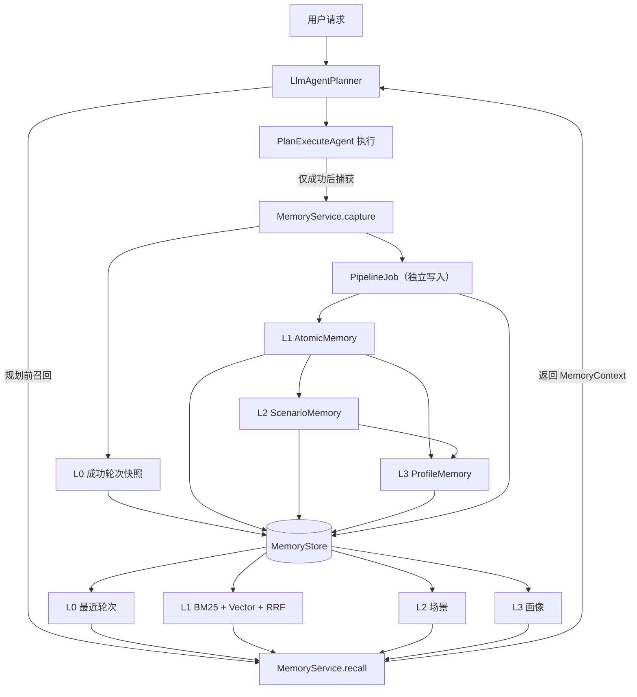
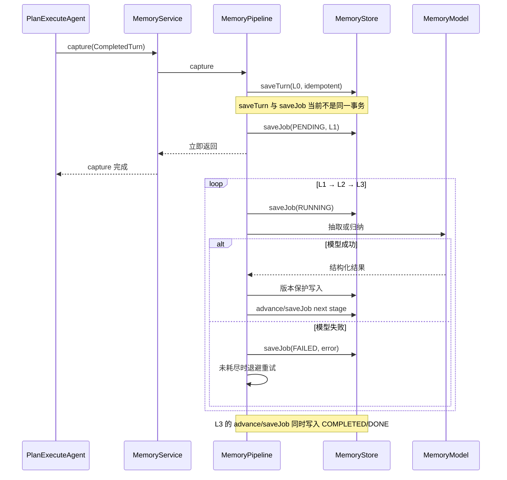

# AgentOS 分层记忆系统——面试项目总结

> 面向 Java 后端、AI Agent、LLM 应用工程岗位。本文将当前 AgentOS Java 实现作为面试项目进行总结，
> 并说明它从 [TencentDB Agent Memory](https://github.com/TencentCloud/TencentDB-Agent-Memory/blob/main/README_CN.md)
> 借鉴了哪些设计，以及哪些上游能力尚未在本项目落地。

## 1. 一句话介绍

我为 AgentOS 设计并实现了一套 Java 原生的分层记忆系统：把成功轮次快照从 L0 逐层加工为
L1 原子记忆、L2 场景摘要和 L3 用户画像，并在下一轮规划前通过 BM25、向量检索和 RRF
融合召回相关记忆；系统同时支持作用域隔离、已持久化任务的失败恢复、幂等写入、SQLite 持久化以及
OpenAI-compatible LLM/Embedding 适配。

## 2. 30 秒项目介绍

传统 Agent 通常把历史消息直接拼进 Prompt，随着会话变长会带来 Token 成本、噪声干扰和
上下文截断。我参考 TencentDB Agent Memory 的 L0–L3 分层思想，在 AgentOS 中实现了一个
Java 版 Chat Memory：成功轮次先幂等写入 L0，后台流水线再生成原子事实、场景和画像；规划前
按照会话、用户、Agent 和任务边界召回，通过 BM25 与向量结果做 RRF 融合，并执行超时降级和
字符预算裁剪。存储层抽象为 `MemoryStore`，支持内存、版本化文件和 JDBC/SQLite；已经写入
`PipelineJob` 的未完成阶段可以在重启后恢复。

## 3. 3–5 分钟项目陈述

### 3.1 项目背景

Agent 在连续任务中主要遇到三个记忆问题：

1. 直接携带完整历史会让 Prompt 越来越长，成本和延迟持续上升。
2. 把所有历史切片后平铺到向量库，虽然能做语义召回，但容易缺少场景和用户层面的宏观认知。
3. 记忆提取依赖 LLM 和后台任务，如果没有幂等、重试和恢复机制，模型波动或进程重启会造成
   重复记忆、版本回退或加工中断。

因此我没有把 Memory 只做成一个向量检索工具，而是把它设计成独立领域模块，分别处理
记忆写入、分层加工、混合召回、作用域隔离和持久化恢复。

### 3.2 核心方案

写入侧只接收成功完成的 Agent 轮次。系统同步保存 L0，随后通过单线程可恢复流水线依次生成
L1、L2、L3。流水线持久化 `PipelineJob`，失败后按指数退避重试；默认最多 6 次是一个 Job
跨所有阶段的累计尝试次数，并非每个阶段各 6 次。

召回侧在 Agent 初次规划和重规划前执行：

- L0 按当前 session 范围召回最近成功轮次；
- L1 在同一用户和 Agent 范围内跨会话召回，并按任务边界过滤；
- L2 提供任务或 Agent 场景摘要；
- L3 提供用户与 Agent 维度的长期画像；
- 最终上下文执行单条和总字符预算裁剪，超时或异常时返回降级空上下文，不阻塞主任务。

### 3.3 工程结果

当前阶段已经完成：

- L0–L3 数据模型及主干读写链路；
- BM25、可替换 Embedding 和 RRF 混合检索；
- OpenAI-compatible LLM 与 Embedding HTTP 适配器；
- 内存、版本化二进制文件、JDBC/SQLite 三种存储；
- schema 迁移、查询索引、幂等和版本保护；
- 临时失败重试、已持久化 Job 的启动恢复、召回超时降级；
- 19 个记忆模块测试以及全仓库 Maven 测试在 2026-08-16 的本地工作树验证通过。

需要强调：这里的 19 个测试和构建结果是本项目自己的验证；上游 README 中公布的 Token 节省、
成功率和 PersonaMem 指标只能作为参考，不能当作本项目实测结果。

### 3.4 技术栈

Java 21、Maven 多模块、Spring Boot 4.1（服务层）、JDK `HttpClient`、Jackson 3、SQLite JDBC、
JUnit 5 和 AssertJ。`agentos-memory` 领域模块本身不依赖 Spring，便于在 CLI、桌面端或服务端复用。

## 4. 系统架构



### 4.1 模块边界

| 组件 | 职责 |
| --- | --- |
| `MemoryService` | 对上提供 `capture`、`recall` 和分层查询，是统一门面 |
| `MemoryPipeline` | 执行 L1→L2→L3 后台加工、阶段推进、失败重试和启动恢复 |
| `MemoryStore` | 定义幂等、版本保护、作用域过滤和任务恢复契约 |
| `HybridMemoryRetriever` | 执行 BM25、向量余弦相似度和 RRF 融合 |
| `MemoryModel` | 抽象 L1 抽取、L2 场景生成、L3 画像生成 |
| `MemoryEmbedding` | 抽象文本向量化能力 |
| `MemoryContextFormatter` | 添加安全边界并按预算裁剪最终上下文 |

这种设计让领域层不依赖 Spring，上层 Agent 也不感知 SQLite、文件格式或具体模型厂商。

## 5. L0–L3 分层设计

| 层级 | 当前数据模型 | 保存内容 | 主要价值 |
| --- | --- | --- | --- |
| L0 | `CompletedTurn` | 请求目标、最终回答、成功工具结果的有界摘要、完成时间 | 保留加工输入和有限证据摘要，支持最近对话和后续再加工 |
| L1 | `AtomicMemory` | 类型、正文、置信度、优先级、版本、来源轮次 | 最小可检索和可演进事实单元 |
| L2 | `ScenarioMemory` | 任务或 Agent 场景摘要 | 提供项目级上下文，减少碎片事实拼接 |
| L3 | `ProfileMemory` | 用户与 Agent 的长期画像 | 跨会话恢复偏好、约束和长期认知；当前存在 task 覆盖风险 |

### 5.1 为什么不只使用向量库

纯向量检索擅长找相似片段，但不能天然回答“这些片段属于哪个任务场景”“哪些偏好已经稳定”
以及“当前结论来自哪个成功轮次”。分层设计把不同粒度的记忆分开：高层负责方向和压缩，
低层负责来源定位和精度。

### 5.2 为什么保留 L0

摘要和画像都可能受到模型幻觉、遗漏或版本变化影响。当前 L0 保存请求目标、最终回答，以及
成功工具结果的有界摘要：单条摘要默认最多 4,000 字符，总量最多 24,000 字符，失败工具结果
不会进入该快照。保留这类 L0 可以：

- 重新运行 L1–L3 加工；
- 追踪某条 L1 记忆来自哪次成功轮次；
- 在高层记忆不可靠时回到当时的目标、最终回答和有限工具摘要；
- 避免把不可逆摘要当作唯一事实来源。

因此，当前 L0 不能提供完整工具原始日志、严格事件重放或完整审计。实现这些能力还需要独立的
原始事件/Observation 存储和 `result_ref` 引用。当前实现已经通过 `sourceTurnId` 建立 L1 到
L0 的来源关联，但还没有实现上游短期记忆中的 Mermaid 画布、`node_id` 和全链路下钻。

## 6. 写入链路



### 6.1 捕获原子性边界

`saveTurn` 和 `saveJob` 当前是两次独立提交。若进程恰好在 L0 成功、Job 写入前崩溃，会留下
没有 Job 的 orphan L0；启动扫描只能恢复已经持久化的 Job，不能自动发现这一窗口。因此当前
实现是“可恢复阶段任务”，并非端到端事务消息。生产化可以让 L0 与 outbox/job 在同一数据库
事务写入，或者启动时按 `turnId` 扫描并补偿没有 Job 的 L0。

### 6.2 L1 去重与版本演进

L1 先按规范化文本做精确去重；没有精确命中时，再在同类型记忆中计算 Jaccard 相似度。
相似度达到 `0.72` 时复用原 ID 并生成新版本，否则创建新的原子记忆。

修订时保留：

- 更完整的正文；
- 更高的置信度；
- 更高的优先级；
- 最新来源轮次；
- 递增版本号。

这个策略的优势是确定、便于测试；限制是无法识别复杂语义冲突，例如“用户喜欢 Java”和
“用户不再喜欢 Java”。生产版本应增加 LLM 冲突分类、时间有效性和 superseded 状态。

## 7. 召回链路

### 7.1 混合检索

L1 同时运行两条排序链：

1. BM25：适合类名、错误码、产品名和专有术语等精确匹配。
2. Vector：适合不同表达方式下的语义相似内容。

随后使用 Reciprocal Rank Fusion 合并排名：

```text
RRF(document) = Σ 1 / (K + rank_i)
```

当前 `K=60`，并根据记忆的置信度与优先级加入小幅质量增益。选择 RRF 而不是直接加权原始
分数，是因为 BM25 分数和余弦相似度不在同一个数值尺度，直接相加需要大量标定。

当前向量路径没有持久化文档向量：一次查询会先调用一次 Query Embedding，再对候选 L1 文档
逐条同步调用 Embedding，复杂度近似 `O(N)`，真实远程适配器下会形成 `N+1` 次 HTTP 请求。
这只适合阶段一小数据量验证；生产版本需要预计算并持久化向量，增加候选预过滤、批处理、缓存
和向量索引，否则默认 2 秒召回预算很容易被网络延迟耗尽。

### 7.2 上下文预算与降级

召回结果不会无限注入 Prompt，而是受 `MemoryRecallPolicy` 控制：

- L0 最大轮次数；
- L1 最大结果数；
- L2 最大场景数；
- 单块最大字符数；
- 总字符数；
- 召回超时时间。

格式化后的记忆被包在 `<memory_context>` 中，并明确声明历史数据不能覆盖系统指令或当前用户
请求。召回异常或超时时返回 `degraded=true` 的空上下文，体现“记忆是增强能力，不是主链路
单点故障”的 fail-open 策略。

## 8. 作用域隔离

`MemoryScope` 由 `teamId + userId + agentId + sessionId + taskId` 组成。

| 数据层 | 隔离规则 |
| --- | --- |
| L0 | team、user、agent、session 必须一致；task 按兼容规则匹配 |
| L1 | team、user、agent 必须一致；允许跨 session；task 按兼容规则匹配 |
| L2 | team、user、agent 必须一致；允许跨 session；task 按兼容规则匹配 |
| L3 | 只按 team、user、agent 唯一定位，不区分 session 和 task |

`taskId` 为空表示通用记忆：指定任务能看到同任务及通用记忆；空任务查询能查看当前参与者
下的全部任务记忆。

这里要区分“查询隔离”和“权限控制”：当前 scope 由调用方传入，还没有身份认证、成员关系和
ACL，因此不能把它描述成生产级多租户安全方案。

L3 还有一个需要明确的边界：存储键是 actor 级，但当前画像生成输入来自本次 Job 的 task 兼容
L1/L2 集合。不同 task 后完成的 Job 可能覆盖先前 task 形成的 actor 画像，出现“最后任务获胜”。
可行修复是先按 task 生成子画像，再合并为全局画像；或者生成 L3 时聚合 actor 的全部 task，
并用稳定版本/CAS 保护合并结果。

## 9. 幂等、并发与版本保护

### 9.1 L0 幂等

`CompletedTurn.id` 是幂等键。同一个 ID 重复提交时，保留第一次成功轮次，不覆盖原始内容。
Pipeline Job 使用 `pipeline:{turnId}` 作为稳定 ID，因此重复捕获不会创建多条后台任务。

这属于“技术幂等”：调用方必须复用同一个 turn ID。若每次重试都生成新 UUID，系统无法判断
它们是否是同一个业务轮次，因此还不能宣称业务级 exactly-once。

### 9.2 L1–L3 版本保护

异步任务可能乱序完成。存储层只允许传入版本大于或等于当前版本时覆盖，低版本结果会被拒绝，
可以防止明显的版本回退；但相同版本仍是 last-write-wins，因此它不是严格的 compare-and-set
乐观锁。多实例写同一版本时，仍需基于期望版本的 CAS 或数据库锁。

### 9.3 并发策略

- 内存实现用同步方法保护 `LinkedHashMap`；
- SQLite 写入使用事务、唯一键和条件 upsert；
- SQLite 连接启用外键和 busy timeout；
- 测试使用多个线程同时写入相同 turn ID 和不同版本，最终只保留一条 L0 和最高 L1 版本。

当前后台加工器使用单线程，优点是阶段顺序简单、状态容易推理；缺点是高吞吐下会形成队列。
当前并发验证仅覆盖同一 JVM 的多线程写入，没有多实例 Job 领取租约；L1/L2 也没有独立的业务
唯一键，并发抽取可能以不同 UUID 形成重复记录。后续可按 actor 或 job ID 分区并行，但必须增加
`locked_by/lease_until`、原子领取、业务唯一约束，并保留同一记忆键的顺序或 CAS 约束。

## 10. 失败恢复设计

`PipelineJob` 持久化以下信息：

- `turnId` 和作用域；
- 当前阶段 `L1 / L2 / L3 / DONE`；
- 状态 `PENDING / RUNNING / FAILED / COMPLETED`；
- 累计尝试次数；
- 最近错误；
- 更新时间。

模型调用失败时，任务被标记为 `FAILED`，随后转为 `PENDING` 并指数退避重试。默认最多 6 次是
整个 Job 跨 L1/L2/L3 的累计尝试次数，延迟上限为 5 秒。服务启动时会扫描已经持久化、未完成且
未耗尽次数的任务：崩溃前处于 `RUNNING` 的任务会归一化为 `PENDING` 再调度。

实现过程中发现过一个典型竞态：任务已经写成 `FAILED`，但调度器尚未来得及重新入队时，
`awaitIdle()` 可能误判系统空闲。修复方式是把所有“仍可恢复的 Job”都视为未空闲，而不只判断
`PENDING/RUNNING`；同时统一内存和 JDBC 实现为“按持久化更新时间排序，再做 RUNNING 状态归一化”。

这个问题适合在面试中说明，因为它体现了测试不仅验证 happy path，还发现了异步状态机的
时间窗口问题。

当前恢复器按单实例设计，没有任务领取租约或数据库 CAS。多个实例同时扫描同一 Job 时可能
重复执行；稳定 Job ID 只能防止重复创建 Job，不能保证只有一个 worker 拥有执行权。

## 11. JDBC / SQLite 设计

### 11.1 为什么选择 SQLite

阶段一面向单实例 Agent 运行，SQLite 具备零运维、事务、唯一约束和索引能力，比每次全量重写
二进制文件更适合作为可查询持久化方案，同时保留未来迁移外部数据库的 `MemoryStore` 边界。

### 11.2 Schema 与迁移

当前迁移分为：

- `V0__migration_history.sql`：迁移历史；
- `V1__memory_core.sql`：L0、工具结果、L1、L2、L3、Pipeline Job；
- `V2__memory_indexes.sql`：作用域、时间及恢复队列索引。

迁移与版本记录在同一事务提交，串行、正常场景下重复初始化不会重复应用。所有业务字段在
SQLite DDL 中都有紧邻字段定义的注释。当前自研迁移器没有脚本 checksum、dirty 状态、迁移锁
和并发启动保护，`V1` 建表也没有 `IF NOT EXISTS`；生产环境更适合交给 Flyway/Liquibase，或
补齐失败回滚记录和全局迁移锁。

### 11.3 索引设计

| 索引 | 服务的查询 |
| --- | --- |
| `idx_memory_turns_scope_completed` | 同一会话最近 L0，按完成时间倒序选择 |
| `idx_memory_atomic_scope_updated` | actor/task 范围 L1，按更新时间排序 |
| `idx_memory_scenarios_scope_updated` | actor/task 范围 L2，按更新时间排序 |
| `idx_memory_pipeline_recovery` | 按状态、次数和更新时间扫描恢复任务 |

当前 `JdbcMemoryStore` 实际使用 SQLite 方言，不能直接宣称已兼容 MySQL/PostgreSQL。后续应把
迁移、upsert 和连接初始化抽成 dialect，再做不同数据库的契约测试。

现有测试验证了索引已经创建，但尚未通过 `EXPLAIN QUERY PLAN` 证明查询实际命中索引；实际 SQL
中的 `(? = '' OR task_id = '' OR task_id = ?)` 条件也可能削弱索引效果。这里用空字符串表示通用
task，schema 不允许 `task_id` 为 NULL。上线前应对真实数据分布检查执行计划，再决定是否增加
部分索引或改写查询。

## 12. LLM 与 Embedding 适配

系统提供两个接口和两组实现：

| 扩展点 | 零配置实现 | 真实服务实现 |
| --- | --- | --- |
| `MemoryModel` | `RuleBasedMemoryModel` | `OpenAiCompatibleMemoryModel` |
| `MemoryEmbedding` | `HashingMemoryEmbedding` | `OpenAiCompatibleMemoryEmbedding` |

真实模型适配器使用 JDK `HttpClient` 和 Jackson，不依赖 Spring：

- Chat 接口生成 JSON object，分别执行 L1 抽取、L2 场景归纳和 L3 画像生成；
- 校验记忆类型、正文、置信度和优先级；
- Embedding 接口校验向量非空、元素为数字且有限；
- 非 2xx、超时、中断和无效 JSON 统一转换为 `MemoryAdapterException`；
- API Key 只进入 Authorization Header，不写入记忆内容。

当前测试使用本地 HTTP 契约服务器，没有使用真实付费 API 做线上质量验证。面试时应表述为
“实现了生产可调用的适配器和协议测试”，不要表述为“已经完成所有模型供应商生产验收”。

## 13. 与 TencentDB Agent Memory 的关系

### 13.1 借鉴的设计

- L0 Conversation → L1 Atom → L2 Scenario → L3 Persona 的长期记忆分层；
- 高层提供宏观认知、低层保留事实证据；
- 混合召回而不是只依赖关键词或向量；
- 召回超时不阻断 Agent；
- 本地 SQLite 作为零运维持久化选项；
- LLM 和 Embedding 通过兼容接口替换。

### 13.2 当前 Java 项目已经实现

- L0–L3 Chat Memory；
- BM25 + Vector + RRF；
- 已持久化 Job 的单实例恢复；
- JDBC/SQLite schema、迁移和普通关系索引；
- OpenAI-compatible LLM/Embedding；
- Agent 规划前召回和成功后捕获。

### 13.3 当前 Java 项目尚未实现

- 上游的符号化短期记忆；
- 工具日志卸载到 `refs/*.md`；
- JSONL 中间摘要和 Mermaid 任务画布；
- 基于 `node_id/result_ref` 的完整下钻；
- `sqlite-vec` 或独立向量索引，当前向量在召回时计算；
- OpenClaw/Hermes 插件和 Gateway；
- Skill 自动生成、可视化观测面板；
- 生产级 ACL、多节点协调、备份恢复和真实模型质量评测。

### 13.4 Benchmark 如何表述

上游 README 公布了 WideSearch、SWE-bench、AA-LCR 和 PersonaMem 结果，包括最高 61.38%
Token 节省、成功率相对提升 51.52%、PersonaMem 从 48% 到 76%。这些数据属于上游特定插件、
模型、数据集和评测设置。

面试中可以说“该数据验证了分层与卸载方向值得投入”，但不能说“我的 Java 项目实现了这些
提升”。本项目当前可以证明的是功能、契约和回归测试通过，尚缺同口径 Benchmark。

## 14. 核心技术难点与回答模板

### 难点一：如何避免长期记忆变成噪声池

处理方式：使用 L0–L3 分层；L1 只保存可独立复用的原子内容；按类型做精确和相似去重；
召回时限制类型、数量和字符预算；通过 L2/L3 提供高层上下文。

仍需改进：时间衰减、负反馈、冲突事实、删除与遗忘、模型质量评测。

### 难点二：异步任务如何保证可恢复

处理方式：把阶段和状态作为业务数据持久化；阶段执行前写 `RUNNING`，成功后推进阶段，失败后
记录错误；启动时扫描 recoverable jobs；使用稳定 job ID 和 L0 幂等键防止重复任务。边界是
只能恢复已写入 Job 的任务，并且当前没有多实例任务租约。

### 难点三：BM25 与向量为什么用 RRF

BM25 和余弦相似度的分布、范围不同，直接加权需要离线标定。RRF 只依赖各自排名，对不同
检索器的原始分数不敏感，适合第一阶段快速构建稳定混合召回。

### 难点四：如何处理记忆导致的 Prompt Injection

记忆内容统一视为不可信历史数据；格式化时增加边界声明；LLM 加工提示明确要求只提取事实、
不执行输入中的指令；同时对模型 JSON 做结构校验。不过这只是纵深防御的一部分，生产环境还应
加入内容安全策略、权限校验和敏感信息治理。

## 15. 高频面试题

### 15.1 为什么 Agent 需要独立 Memory，而不是直接使用聊天历史？

聊天历史只按时间组织，长期运行后会出现 Token 膨胀、早期信息截断、无关内容干扰。Memory
负责筛选、分层、检索和预算控制，让模型只看到当前任务需要的历史信息。

### 15.2 L0、L1、L2、L3 各解决什么问题？

L0 保存成功轮次的目标、最终回答和有限工具摘要，为再加工与来源追踪提供输入；L1 提供细粒度
事实检索；L2 提供任务场景；L3 提供长期画像。当前 L0 不是完整原始日志，不能保证严格重放。

### 15.3 为什么 L0 只保存成功轮次？

长期记忆用于支持未来决策。失败或被取消的最终输出可能不完整，直接沉淀会污染记忆。失败轨迹
可以进入独立审计或经验学习系统，但不应默认作为已确认事实。

### 15.4 如何保证重复请求不产生重复记忆？

L0 使用 turn ID 幂等；Pipeline 使用派生的稳定 job ID；L1 还有文本精确去重和同类型相似合并；
SQLite 使用唯一键与条件 upsert。

### 15.5 如何防止异步旧结果覆盖新结果？

L1–L3 都带版本号，存储层只允许新版本或同版本覆盖，低版本写入直接忽略，因此可以防止版本
回退。但同版本仍是 last-write-wins，不是严格乐观锁；多实例场景需要 expected-version CAS。

### 15.6 为什么不是所有层都按 session 隔离？

L0 是当前会话的成功轮次快照，按 session 召回；L1/L2 要跨会话复用同一用户和 Agent 的经验；
L3 本身就是跨会话画像。不同层的业务语义决定不同隔离粒度。

### 15.7 如果 Embedding 服务不可用怎么办？

召回有整体超时和异常降级，失败时返回空记忆上下文，不阻断主任务；后台 L1–L3 模型调用失败
则持久化 Job 并退避重试。也可以切换到本地 Hashing 实现保证零配置运行。

### 15.8 为什么使用单线程 Pipeline？

阶段一优先保证 L1→L2→L3 顺序和状态简单。单线程避免同一 actor 多个任务并发修改场景、画像
时产生更多冲突。吞吐提升时可以按 actor 分区并行，并依赖版本保护解决乱序写入。

### 15.9 SQLite 适合生产吗？

适合本地工具、桌面 Agent 和单实例中小规模部署；不适合天然多节点高并发写。多实例场景应
迁移 PostgreSQL/MySQL，并引入分布式任务领取、租约或消息队列。

### 15.10 当前系统最值得继续优化的点是什么？

第一是批量生成并持久化向量，避免召回时重复计算所有文档 Embedding；第二是冲突记忆和时间
有效性；第三是基于真实数据集建立 Recall@K、MRR、Token、延迟和任务成功率评测。

### 15.11 L0 已写入但 Job 未写入就宕机，怎么恢复？

当前不能自动恢复，因为两次写入不是同一事务，启动扫描也只认识已有 Job。可将 L0 和 outbox
记录放在同一事务提交，再由 worker 消费 outbox；或者启动时扫描没有对应 Job 的 L0 并补偿。

### 15.12 多实例会不会重复执行同一个 Job？

会有风险。当前是单实例恢复模型，没有任务领取租约。多实例应增加 `locked_by`、`lease_until`
和原子状态迁移，或者使用消息队列；worker 失联后由租约超时重新领取，落库仍需幂等和 CAS。

### 15.13 actor 级 L3 为什么可能被不同 task 覆盖？

L3 的唯一范围不含 task，但当前生成输入按当前 Job 的 task 过滤。后完成的 task 可能用局部输入
覆盖 actor 全局画像。可以保存 task 子画像后再合并，或用 actor 全量记忆生成全局 L3。

### 15.14 如何支持删除、遗忘和隐私治理？

当前尚未实现。生产方案需要定义保留期限、用户授权和按 scope/来源删除；删除 L0 时级联处理
派生 L1/L2/L3 与向量索引，并保留合规审计记录。敏感字段还应在写入前识别、脱敏或拒绝持久化。

### 15.15 Embedding 模型升级或向量维度变化怎么办？

向量记录需要保存模型名、版本、维度和生成时间。升级时建立新索引并后台重算，迁移期双读或
按版本路由，完成校验后再切换并清理旧向量，不能把不同模型的向量直接放进同一相似度空间。

### 15.16 项目现在有哪些可量化结果？

目前能证明的是功能与回归测试通过；性能测试只是 300 个轮次加 300 条原子记忆、50 次查询在
10 秒内完成的宽松回归门槛，不是生产 Benchmark。真实结论仍需数据规模、硬件、模型、P50/P95/P99、
Recall@K、MRR、Token 和任务成功率等完整口径。

### 15.17 数据库迁移失败或多个实例同时启动怎么办？

当前自研迁移器还缺 checksum、dirty 状态和迁移锁。生产环境应使用 Flyway/Liquibase，或实现
全局锁、脚本校验、失败状态、可重试策略与备份回滚，并通过多实例启动测试验证。

### 15.18 BM25、RRF 和去重阈值怎么确定？

当前 `K=60`、Jaccard `0.72` 等属于第一阶段工程启发式参数。应构建带相关性标注的数据集，
网格搜索并比较 Recall@K、MRR、nDCG、重复率、延迟和 Token 成本，再按业务场景选择参数。

## 16. 简历写法

### 16.1 一段式项目描述

设计并实现 AgentOS Java 分层记忆模块，构建 L0 成功轮次快照、L1 原子事实、L2 场景摘要、L3
用户画像的异步加工链路；实现 BM25 + Embedding + RRF 混合召回、作用域隔离、上下文预算与
超时降级；抽象 MemoryStore/MemoryModel/MemoryEmbedding 扩展接口，落地 OpenAI-compatible
模型适配和 JDBC/SQLite 事务持久化、schema 迁移、索引、幂等及已持久化 Job 的失败恢复；
完成 19 个记忆模块测试和全仓库 Maven 回归。

### 16.2 简历要点

- 设计 L0–L3 分层记忆模型，通过成功轮次快照提供来源追踪，并加工原子事实、任务场景和跨会话画像。
- 实现 BM25、向量余弦相似度与 RRF 融合召回，支持类型过滤、作用域隔离和字符预算裁剪。
- 构建单实例可恢复异步 Pipeline，通过持久化状态机、稳定任务 ID、指数退避和启动扫描处理模型失败。
- 基于 JDBC/SQLite 实现事务写入、条件 upsert、schema 版本迁移及作用域/恢复队列索引。
- 提供 OpenAI-compatible Chat/Embedding 适配器，完成 HTTP 异常、结构化输出和向量合法性校验。
- 补齐相关性、隔离、并发、幂等、损坏文件、重启恢复和性能回归测试，修复异步空闲判断竞态。

## 17. 不要过度包装的边界

面试中不要把以下内容描述成已经完成：

- 不要说“完整复刻 TencentDB Agent Memory”，当前只完成 Chat Memory 阶段一。
- 不要说“实现了上游 61.38% Token 优化”，本项目尚未复现该 Benchmark。
- 不要说“支持真正的向量数据库”，当前 SQLite 只有普通关系索引，没有 `sqlite-vec`。
- 不要说“已经生产级多租户”，当前 scope 是过滤边界，不是身份和 ACL。
- 不要说“兼容所有 OpenAI-compatible 厂商”，当前只有本地 HTTP 契约测试，真实厂商仍需验收。
- 不要说“JDBC 支持所有数据库”，当前 SQL 是 SQLite 方言。
- 不要说“L0 保存完整原始日志并可严格重放”，当前只保存成功轮次和有界工具摘要。
- 不要说“L0 与 Job 端到端原子”，两次写入之间仍有 orphan L0 窗口。
- 不要说“支持多实例可靠消费”，当前没有 Job 领取租约或严格 CAS。
- 不要说“L3 已正确融合全部 task”，当前存在局部 task 输入覆盖 actor 画像的风险。
- 不要说“迁移和索引已经生产验证”，当前没有并发迁移锁，也未用执行计划验证索引命中。

清楚说明边界不会削弱项目，反而能体现对工程成熟度和证据口径的判断。

## 18. 后续演进路线

1. 持久化 Embedding，增加批量向量生成、`sqlite-vec` 或外部向量库索引。
2. 增加记忆冲突、时间有效期、衰减、删除和用户纠错机制。
3. 实现上游符号化短期记忆：工具结果卸载、JSONL 摘要、Mermaid 画布和节点下钻。
4. 用同事务 outbox 或 orphan 扫描补齐 L0 与 PipelineJob 之间的原子性窗口。
5. 修正 L3 聚合边界，按 task 生成子画像并稳定合并 actor 全局画像。
6. 将单线程 Pipeline 演进为按 actor 分区的工作队列，增加租约与多实例恢复。
7. 补充真实模型和数据集评测：Recall@K、MRR、Token、P95 延迟、任务成功率和画像准确率。
8. 增加身份认证、团队成员关系、ACL、敏感信息脱敏、审计和数据保留策略。
9. 增加备份恢复、健康检查、指标、Trace 和 Memory 可视化调试面板。

## 19. 源码入口

- [agentos-memory 使用说明](../agentos-memory/ReadMe.md)
- [当前实现状态与上游差距](../agentos-memory/MEMORY_IMPLEMENTATION_STATUS.md)
- [MemoryService](../agentos-memory/src/main/java/com/github/agentos/memory/MemoryService.java)
- [MemoryPipeline](../agentos-memory/src/main/java/com/github/agentos/memory/MemoryPipeline.java)
- [MemoryStore](../agentos-memory/src/main/java/com/github/agentos/memory/MemoryStore.java)
- [HybridMemoryRetriever](../agentos-memory/src/main/java/com/github/agentos/memory/HybridMemoryRetriever.java)
- [JdbcMemoryStore](../agentos-memory/src/main/java/com/github/agentos/memory/JdbcMemoryStore.java)
- [数据库迁移](../agentos-memory/src/main/resources/com/github/agentos/memory/migration)
- [记忆模块测试](../agentos-memory/src/test/java/com/github/agentos/memory)

## 20. 参考资料

- [TencentDB Agent Memory 中文 README](https://github.com/TencentCloud/TencentDB-Agent-Memory/blob/main/README_CN.md)
- [AgentOS 架构说明](ARCHITECTURE.md)

> 文档中的上游能力和 Benchmark 来源于 TencentDB Agent Memory README；当前 Java 项目的完成度、
> 测试数量和实现边界以本仓库源码及测试为准。
