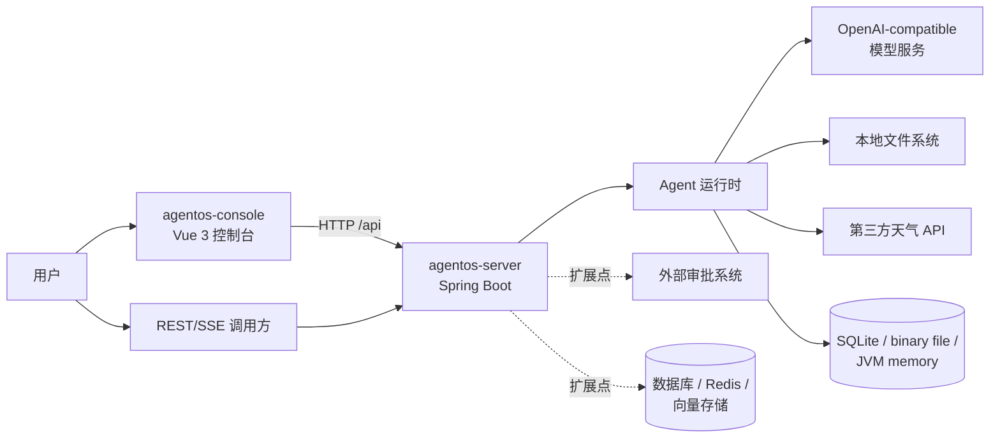
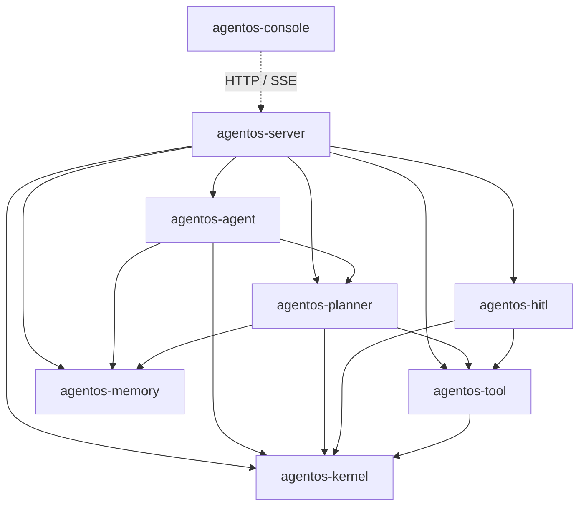
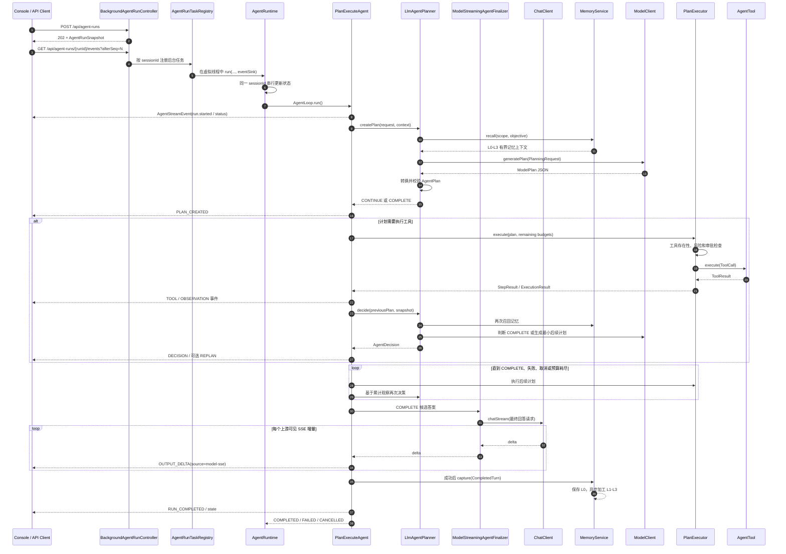
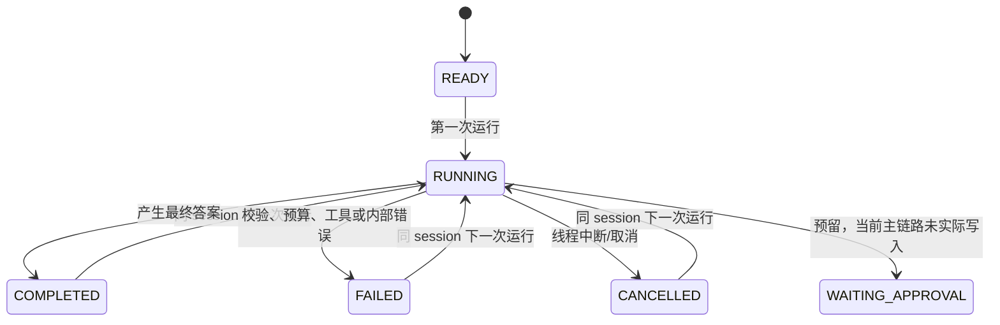
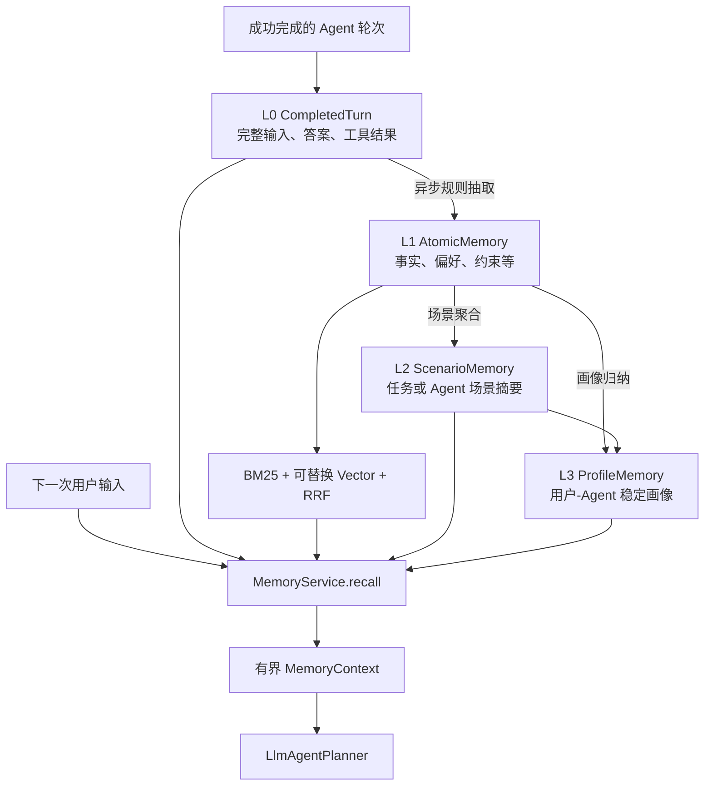

# AgentOS 项目架构说明

> 文档基线：2026-08-11 当前工作区代码
>
> 目标读者：首次接触项目的研发、架构和运维人员
>
> 说明：本文以实际代码和构建配置为准；各模块 README 仅作为辅助资料。

## 1. 项目定位

AgentOS 是一个基于 Java 21 的模块化 Agent 运行时原型。它把一次 Agent 请求拆成“记忆召回、模型规划、计划校验、工具执行、观察汇总、完成判断或重规划、结果记忆化”等阶段，并通过 Spring Boot 对外提供同步 REST 和 SSE 流式接口。

项目采用“领域核心与框架适配分离”的结构：`agentos-kernel`、`agentos-planner`、`agentos-tool`、`agentos-memory`、`agentos-hitl` 和 `agentos-agent` 保持为纯 Java 模块；只有 `agentos-server` 感知 Spring。`agentos-console` 是独立的 Vue 3 前端，不进入 Maven Reactor。

当前实现适合单机开发、架构验证和能力扩展，尚不是开箱即用的多租户生产平台。运行状态、任务注册、默认存储、权限与审批能力都仍具有明显的单机或原型特征。

## 2. 技术栈

| 层次 | 技术与版本 | 用途 |
| --- | --- | --- |
| Java 运行时 | Java 21 | Record、虚拟线程、领域核心 |
| 后端构建 | Maven 多模块 | 依赖管理、测试和可执行 JAR 打包 |
| Web 框架 | Spring Boot 4.1.0 | 依赖注入、REST、SSE、配置管理 |
| HTTP 客户端 | JDK `java.net.http.HttpClient` | 调用 OpenAI-compatible 模型和天气服务 |
| JSON | Spring Boot 4 使用的 Jackson API | 模型请求、结构化计划和 API 序列化 |
| 文档解析 | Apache POI 5.4.1、PDFBox 3.0.4 | DOCX、PDF 文件读取 |
| 前端 | Vue 3.5、Vite 7、JavaScript | Agent 操作控制台 |
| Markdown 展示 | marked、DOMPurify | 安全渲染 Agent Markdown 输出 |
| 默认持久化 | 自定义本地二进制文件 | 保存 L0–L3 记忆和管线任务 |

## 3. 系统上下文



当前系统可选用本地 SQLite 数据库，但没有外部数据库、消息队列或服务注册中心。除模型和天气接口外，默认运行所需数据均位于单个 JVM 和本地文件系统中。

## 4. 模块划分与依赖

### 4.1 Maven 模块依赖



依赖方向总体保持由上层编排指向下层协议。`agentos-kernel` 位于最底层；Spring 依赖只存在于 `agentos-server`。

### 4.2 模块职责

| 模块 | 核心职责 | 关键类型 | 运行时依赖 |
| --- | --- | --- | --- |
| `agentos-kernel` | 请求、上下文、状态、事件和会话级运行入口 | `AgentRequest`、`AgentContext`、`AgentState`、`AgentRuntime`、`AgentRunEvent` | 无其他 AgentOS 模块 |
| `agentos-tool` | 工具协议、统一调度、失败分类和内置工具 | `AgentTool`、`ToolRegistry`、`ToolDispatcher`、`ToolResult` | `agentos-kernel` |
| `agentos-memory` | L0–L3 记忆、异步加工、混合召回、HTTP 模型适配和本地持久化 | `MemoryService`、`MemoryPipeline`、`MemoryStore`、`HybridMemoryRetriever` | 无其他 AgentOS 模块 |
| `agentos-hitl` | 工具风险策略和人工审批端口 | `RiskPolicy`、`ApprovalService` | `agentos-kernel`、`agentos-tool` |
| `agentos-planner` | 模型规划、计划校验、工具步骤执行、观察和失败决策 | `LlmAgentPlanner`、`PlanValidator`、`PlanExecutor` | kernel、tool、memory |
| `agentos-agent` | 串联规划、执行、决策、终结和记忆写入 | `PlanExecuteAgent`、`AgentFinalizer` | kernel、planner、memory |
| `agentos-server` | Spring 装配、模型适配、REST/SSE API 和集成测试 | `AgentOsConfiguration`、`AgentController`、`OpenAiCompatibleModelClient` | 所有后端模块 |
| `agentos-console` | 会话操作、SSE 消费、运行轨迹和状态展示 | `useAgentConsole`、`agentApi`、Vue 组件 | 仅通过 HTTP 依赖 server |

### 4.3 分层边界

- 内核层只负责“如何运行并保存状态”，不了解模型、计划、工具、记忆或 Spring。
- 领域能力通过 Java 接口隔离：`AgentLoop`、`AgentPlanner`、`ModelClient`、`AgentTool`、`MemoryStore`、`MemoryModel`、`MemoryEmbedding`、`ApprovalHandler`。
- `PlanExecuteAgent` 是业务编排中心，但不直接发送 HTTP、不直接读文件，也不直接操作存储实现。
- `agentos-server` 是组合根，负责把接口与默认实现装配成可运行应用。
- 前端与后端只共享 HTTP/SSE 契约，不共享构建、类型或发布产物。

## 5. 核心运行链路

### 5.1 一次流式运行的时序



同步接口 `POST /api/agents/runs` 走相同的 `AgentRuntime → PlanExecuteAgent` 主链路，只是不注册流式任务，也不向客户端发送阶段事件。

### 5.2 运行状态

`AgentState` 是不可变快照，状态定义如下：



`AgentRuntime` 使用 `ConcurrentMap.compute(sessionId, ...)` 保存每个会话最新状态，因此同一 JVM 内、同一 `sessionId` 的状态变更会串行执行；不同会话可以并发执行。状态不持久化，进程重启后会丢失。

## 6. 规划、执行与重规划模型

### 6.1 计划模型

计划有两个相互独立的维度：

| 维度 | 值 | 含义 |
| --- | --- | --- |
| `PlanType` | `DISCOVERY` | 探索未知环境，只允许低风险工具 |
| `PlanType` | `EXECUTION` | 执行任务或输出最终答案 |
| `PlanOutcome` | `CONTINUE` | 包含至少一个待执行工具步骤 |
| `PlanOutcome` | `COMPLETE` | 不包含步骤，必须携带最终答案 |

模型只生成 `ModelPlan` DTO；运行时生成计划 ID 和 `PlanOrigin`。`COMPLETE` 必须同时满足 `EXECUTION + 无步骤 + 非空 finalAnswer`，避免把最终回答伪装成工具调用。

### 6.2 计划生成和校验

`LlmAgentPlanner` 在每次初始规划或决策前完成以下工作：

1. 根据 `teamId/userId/agentId/sessionId/taskId` 构造记忆作用域。
2. 调用 `MemoryService.recall()` 获取有界 L0–L3 上下文。
3. 将请求、身份上下文、记忆、可用工具定义、剩余步骤预算和历史观察组装为 `PlanningRequest`。
4. 通过 `ModelClient` 请求结构化 `ModelPlan`。
5. 将 DTO 转为领域 `AgentPlan`，校验模型结构和运行边界。

`PlanValidator` 会拒绝：

- 单份计划步骤数超过上限；
- 未注册工具；
- 缺失必填参数、未知参数或参数类型错误；
- `DISCOVERY` 计划使用非低风险工具。

### 6.3 执行与失败策略

`PlanExecutor` 顺序执行计划步骤，并把调用交给 `ToolDispatcher`。Dispatcher 通过注册表解析工具，依次执行审批等生命周期拦截器，统一调用工具，并把未捕获异常转换成结构化失败。

| 工具失败类型 | 必选步骤 | 可选步骤 |
| --- | --- | --- |
| `TRANSIENT` | 重试一次；仍失败则重规划 | 重试一次；仍失败则跳过 |
| `NOT_FOUND` | 按错误假设重规划 | 跳过 |
| `INVALID_ARGUMENT` | 按可恢复失败重规划 | 跳过 |
| 访问、权限或安全拒绝 | 终止 | 终止 |
| 工具内部错误或未知错误 | 终止 | 终止 |

执行结果会被确定性地压缩成 `Observation`。规划器只接收有界观察摘要，完整 `StepResult` 仍保留在本次运行内用于审计和最终记忆写入。

### 6.4 重规划触发

以下情况会让 `PlanExecuteAgent` 请求模型做下一次决策：

- `DISCOVERY_COMPLETED`：探索步骤完成，需要基于新事实决定下一步；
- `EXECUTION_COMPLETED`：执行步骤完成，需要综合真实结果；
- `RECOVERABLE_FAILURE`：工具失败但任务仍可恢复；
- `INVALID_ASSUMPTION`：原计划依赖的资源或假设不成立。

决策返回 `COMPLETE` 时直接进入最终答案阶段；只有返回 `REPLAN` 才消耗重规划次数预算。

### 6.5 默认运行预算

| 配置 | 默认值 | 计数口径 |
| --- | ---: | --- |
| `max-replan-count` | 3 | 仅 `DecisionOutcome.REPLAN` |
| `max-step-count` | 30 | 整次运行累计处理步骤数 |
| `max-tool-calls` | 30 | 工具实际调用次数，包含重试 |
| `max-model-calls` | 6 | 初始规划和每次决策调用 |
| `max-observation-chars` | 4,000 | 单条 Observation 最大字符数 |
| `max-observation-total-chars` | 24,000 | 反馈给模型的累计 Observation 字符数 |

这些限制同时控制成本、循环终止性和上下文大小。单份模型计划还有默认 10 步上限，实际可生成步数取单份上限与剩余累计预算的较小值。

## 7. 模型适配层

默认 `OpenAiCompatibleModelClient` 位于 `agentos-server`，通过 JDK 同步 HTTP 客户端调用 OpenAI Chat Completions 兼容接口。该适配器负责：

- 根据当前工具注册表动态生成计划 JSON Schema；
- 发送 system prompt、用户任务、身份上下文、记忆和历史观察；
- 支持 `JSON_SCHEMA`、`JSON_OBJECT`、`NONE` 三种响应格式兼容模式；
- 可选发送 `reasoning_split` 参数；
- 解析对象、JSON 字符串或文本数组形式的 assistant content；
- 拒绝非 2xx、模型拒答、非法 JSON 和不符合计划结构的响应；
- 对过长 prompt 保留首尾上下文，并受 `max-prompt-chars` 限制。

`ModelClient` 是规划模块中的端口，业务方可以声明自定义 Spring Bean 覆盖默认实现，因此核心规划逻辑不绑定 MiniMax 或任何特定 SDK。

规划与最终回答采用不同的传输约束：规划请求必须完整返回结构化 JSON 后才能校验和执行，因此不会逐 token 暴露；最终回答通过 `ModelStreamingAgentFinalizer → ChatClient.chatStream → OpenAiCompatibleChatClient` 消费供应商 SSE，并在每个可见增量到达时立即发出 `OUTPUT_DELTA`。该链路不会等待完整回答，也不会按固定字符数重新切片。最终回答调用计入 `max-model-calls`，可通过 `max-final-answer-chars` 和 `max-final-draft-chars` 限制输出与候选上下文。

## 8. 工具与 HITL

### 8.1 工具协议

每个 `AgentTool` 声明稳定名称、说明、参数 Schema、风险等级和执行函数。Spring 会把所有 `AgentTool` Bean 自动注册到 `ToolRegistry`，因此新增工具通常不需要修改注册表代码。

当前内置工具：

| 工具 | 能力 | 主要边界 |
| --- | --- | --- |
| `directory_list` | 递归列目录 | 深度最大 5、条目最大 500、不跟随符号链接 |
| `file_search` | 文件名 glob 或内容字面量搜索 | 深度最大 12、结果最大 500、最多扫描 20,000 文件 |
| `file_read` | 读取文本、DOCX、PDF | PDF 按页和页内偏移续读，每次正文最多 3,000 字符 |
| `git_commit` | 提交明确列出的仓库相对路径 | 高风险、需审批；不推送、不夹带其他改动，已有暂存内容时拒绝 |
| `weather` | 调用第三方接口查询天气 | 外部网络依赖 |
| `echo` | 回显参数 | 主要用于调用链验证 |

### 8.2 风险与审批

`RiskPolicy` 默认要求 `MEDIUM` 及以上风险工具审批，`ApprovalService` 是可替换的审批端口。当前默认审批处理器会拒绝所有需要审批的调用。

但当前所有内置工具都沿用 `AgentTool` 的默认 `LOW` 风险等级，因此默认环境不会实际触发审批。`WAITING_APPROVAL` 状态也只是预留值，现有审批调用是同步布尔返回，不支持挂起后恢复。

## 9. 记忆架构

### 9.1 分层模型



### 9.2 写入流程

只有成功完成的运行才调用 `MemoryService.capture()`：

1. 同步、幂等保存 L0 `CompletedTurn`；
2. 保存可恢复的 `PipelineJob`；
3. 单线程后台管线依次执行 L1、L2、L3；
4. 失败任务采用退避重试，最多 6 次；
5. 文件或 SQLite 模式下，任务状态与记忆数据一起持久化，重启后恢复未完成任务。

记忆写入采用 fail-open：记忆加工异常不会把已经成功的 Agent 运行改成失败。

### 9.3 召回流程和作用域

| 层级 | 召回范围 | 当前策略 |
| --- | --- | --- |
| L0 | 同 team、user、agent、session | 最近完成轮次 |
| L1 | 同 team、user、agent，按兼容 task；可跨 session | BM25 + 可替换向量 + RRF |
| L2 | 同 team、user、agent，按兼容 task；可跨 session | 最近场景摘要 |
| L3 | 同 team、user、agent | 单一画像 |

召回在虚拟线程中执行并带超时。超时或异常时返回降级的空记忆上下文，不阻断主任务。

### 9.4 默认实现与遗留代码

- `MemoryStore` 有 JVM 内存、本地二进制文件和 JDBC/SQLite 三种实现。
- 文件模式将全部状态写入 `.agentos/memory/memory-state.bin`，使用版本化二进制格式、临时文件和原子替换。
- SQLite 模式使用事务化 schema 迁移、作用域索引、版本保护和持久化恢复队列。
- `MemoryModel` 默认是规则模型，也可替换为 `OpenAiCompatibleMemoryModel`。
- `MemoryEmbedding` 默认是本地 Hashing 向量，也可替换为 `OpenAiCompatibleMemoryEmbedding`。
- 早期未接入主链路的 `ShortMemory`、`LongMemory`、`MemoryEntry` 已删除。

## 10. 服务端 API

| 方法 | 路径 | 用途 | 主要响应 |
| --- | --- | --- | --- |
| `POST` | `/api/agents/runs` | 同步执行一次 Agent | `201` + sessionId + 最终状态 |
| `POST` | `/api/agents/{sessionId}/stop` | 中断该会话已注册的流式任务 | 是否发出中断 + 当前状态 |
| `GET` | `/api/agents/{sessionId}/state` | 查询 JVM 内最新会话状态 | `AgentState` 或 `404` |
| `POST` | `/api/agent-runs` | 创建与客户端连接解耦的后台运行 | `202` + runId + 运行快照 |
| `GET` | `/api/agent-runs/{runId}` | 查询后台运行快照 | 状态、结果、pendingAction、lastSeq |
| `GET` | `/api/agent-runs/{runId}/events?afterSeq=N` | 补播游标后的事件并继续 SSE 订阅 | `AgentStreamEvent` 信封 |
| `GET` | `/api/agent-runs/history?sessionId=...` | 重建会话 | 仅可持久化的用户事件 |
| `POST` | `/api/agent-runs/{runId}/cancel` | 显式取消后台运行 | 是否发出中断 + 运行快照 |
| `GET` | `/api/memories` | 按作用域查询 L0–L3 当前快照 | 计数及实际记忆数据 |

SSE 主要事件顺序为：

```text
run.started → status
  → tool.started → [tool.awaiting_approval → tool.approved] → tool.completed | tool.failed
  → [artifact.created]
  → message.started → message.delta* → message.completed
  → usage
  → run.completed | run.failed | run.cancelled
```

SSE 使用 Spring `SseEmitter`，服务端通过虚拟线程执行 Agent。`AgentRunTaskRegistry` 限制同一 `sessionId` 同时只能注册一个任务，并通过 `Thread.interrupt()` 协作取消。后台运行由 `AgentRunCoordinator` 管理：客户端断开只移除订阅者，任务继续执行；只有显式取消接口会请求中断。

## 11. 前端架构

`agentos-console` 是独立 Vue 单页应用：

```text
App.vue
├── SystemHeader.vue       顶部状态和新建会话
├── SessionRail.vue        会话列表、重命名和删除
├── CommandDeck.vue        Agent ID、Session ID 和任务输入
├── TranscriptPanel.vue    用户、阶段事件、答案和错误消息
└── TelemetryRail.vue      运行状态和流水线阶段

useAgentConsole.js         会话状态、执行流程和 localStorage
agentApi.js                REST 调用、后台运行与可恢复 SSE 流解析
```

控制台先通过 `POST /api/agent-runs` 获得 `runId`，再使用 GET SSE 订阅事件。每个事件都有递增 `seq`；前端持续保存 `activeRunId` 和 `lastSeq`，刷新后先查询快照，再以 `afterSeq=lastSeq` 补播缺失事件并继续订阅。

聊天侧栏通过 `/api/sessions/page` 从服务端分页加载会话，服务端会话索引是列表的权威数据源。浏览器使用账号隔离的 `agentos.console.sessions.v2.*` 缓存最近 20 个会话及稳定展示记录；缓存缺失时，前端从 `/api/agent-runs/history` 回放持久化事件。事件使用 `runId + seq` 去重，并按 `itemId` 归约；`message.completed` 覆盖流式草稿。运行中的停止按钮调用显式取消接口。浏览器缓存不等同于后端记忆，清理站点数据不会删除服务端会话与领域事件。

开发环境由 Vite 将 `/api` 代理到 `http://localhost:8080`。生产构建产物位于 `agentos-console/dist`，需要独立静态托管并把 `/api` 反向代理到后端。

## 12. 并发、状态与取消

- 同一 JVM 内，`AgentRuntime` 按 `sessionId` 串行化运行状态更新。
- 不同 session 可以并行；流式运行使用“一任务一虚拟线程”。
- `AgentRunTaskRegistry` 登记后台任务；同步接口不进入该注册表，但仍受 `AgentRuntime` 的 session 串行化约束。
- `AgentRuntime` 在一次 `compute` 结束时才提交新快照，因此运行期间调用状态查询可能看到上一轮终态或 `404`；实时进度应以本次 SSE 事件为准。
- 取消依靠线程中断。`PlanExecuteAgent`、计划执行边界和模型客户端会检查或传播中断，但具体工具仍需要正确响应中断才能及时停止。
- 会话状态、后台运行和可补播事件目前均为进程内数据；可以应对页面刷新和网络闪断，但不能跨实例协调，也不能在服务重启后恢复。
- 记忆后台管线使用单个守护调度线程，保证简单的顺序加工，但吞吐能力有限。

## 13. 配置、构建与部署

### 13.1 构建边界

后端：

```bash
mvn clean test
mvn -pl agentos-server -am package
java -jar agentos-server/target/agentos-server-0.0.1-SNAPSHOT.jar
```

前端：

```bash
cd agentos-console
npm install
npm run build
```

### 13.2 核心配置

Spring 支持以下核心配置；当前运行值见 `agentos-server/src/main/resources/application.yml`，完整可选项见 `application-example.yml`，部分默认值定义在装配代码中：

- `agentos.runtime.*`：累计运行预算和 Observation 长度；
- `agentos.model.*`：模型 ID、端点、API Key、响应格式、超时和 prompt 上限；
- `agentos.memory.mode`：`sqlite`、`file` 或 `memory`；
- `agentos.memory.data-dir`：文件记忆目录；
- `agentos.memory.database-file`：SQLite 数据库文件；
- `logging.*`：日志级别和可选文件滚动策略。

生产环境应通过环境变量或外部配置注入模型密钥，不应把密钥提交到仓库。

### 13.3 可观测性

后端通过结构化日志标签记录主要阶段：`agent-run`、`model-call`、`agent-plan`、`agent-step`、`agent-observation`、`agent-decision`、`agent-replan` 和 `agent-memory`。SSE 事件提供面向客户端的运行轨迹。

当前没有发现 Actuator 健康检查、指标系统、分布式 Trace 或持久化审计事件仓库。

## 14. 主要扩展点

| 目标 | 扩展接口/位置 | 推荐方式 |
| --- | --- | --- |
| 接入新模型 | `ModelClient` | 声明自定义 Bean 覆盖默认适配器 |
| 新增工具 | `AgentTool` | 实现接口并注册为 Spring Bean |
| 调整失败策略 | `FailureClassifier` | 替换分类器 Bean |
| 接入人工审批 | `ApprovalService.ApprovalHandler` | 对接审批页面、消息队列或工作流 |
| 更换记忆存储 | `MemoryStore` | 使用内置 SQLite 或实现 Redis、对象存储、向量库适配器 |
| 更换记忆抽取 | `MemoryModel` | 使用 OpenAI-compatible 适配器或实现其他 LLM 适配器 |
| 更换向量实现 | `MemoryEmbedding` | 使用 OpenAI-compatible Embedding 或实现其他向量服务适配器 |
| 自定义 Agent | `AgentLoop` 或组合 `PlanExecuteAgent` 依赖 | 通过 `AgentRuntime` 暴露统一运行入口 |
| 新增事件消费者 | `AgentEventSink` | 接入审计、消息总线或可观测系统 |

## 15. 当前风险与架构限制

### 15.1 需要优先处理

1. **配置密钥泄露风险**：当前默认 `application.yml` 中疑似存在非空模型密钥。应立即在供应商侧轮换/吊销，移除仓库中的明文值，并检查 Git 历史；仅删除当前文件内容不能消除历史泄露。
2. **宿主机进程需要独立隔离**：文件工具已由 `RootedFileAccessPolicy` 限定根目录，但 Shell、本地代码执行等宿主机进程不能靠工作目录形成沙箱，生产部署应关闭或使用 Docker。
3. **API 无鉴权**：Agent 运行、停止、状态和记忆查询接口未见身份认证与授权。尤其记忆接口可能返回历史输入和用户画像，不能直接暴露到公网。
4. **作用域不是权限模型**：`teamId/userId/agentId/taskId` 当前只是请求参数和数据过滤条件，调用方可以自行传入，不构成可信 ACL。

### 15.2 生产化限制

- `AgentRuntime` 状态和流式任务注册均为单 JVM 内存，不能水平扩展或故障恢复。
- 默认文件存储在每次变更时重写单个二进制状态文件，适合小规模原型；单实例部署可切换 SQLite，但仍未解决跨节点协调和独立向量索引。
- 默认 L1–L3 由规则模型和 Hashing 向量生成；已经提供真实 HTTP 适配器，但需要显式装配、真实供应商契约测试和质量评测。
- HITL 是同步布尔审批，尚无等待、恢复、超时、审批 UI 和审批审计闭环。
- 内置工具全部标为低风险，当前风险门禁对这些工具没有实际拦截效果。
- 前端未接入 `/stop` 接口，用户无法从控制台显式停止任务。
- 天气工具没有显式配置请求超时，外部服务异常可能延长步骤执行时间。
- 当前只有日志和 SSE 事件，没有统一的指标、Trace、健康检查和持久化审计。

## 16. 测试结构

| 模块 | 当前测试重点 |
| --- | --- |
| `agentos-tool` | 文件探索、文件读取与边界行为 |
| `agentos-memory` | L0–L3 召回、存储契约、失败恢复、模型适配、SQLite 迁移/索引/性能 |
| `agentos-planner` | 计划校验、执行、失败策略、Observation、LLM 规划 |
| `agentos-server` | 运行时集成、模型配置、同步/流式 API、记忆 API |

测试主要验证模块行为和单 JVM 集成链路。生产化前仍需补充认证授权、并发压力、SSE 断连、取消及时性、存储损坏恢复、外部服务超时、真实模型兼容和多实例部署测试。

## 17. 推荐阅读顺序

新成员可以按以下顺序理解代码：

1. [`AgentRuntime`](../agentos-kernel/src/main/java/com/github/agentos/kernel/AgentRuntime.java)：会话状态和运行边界；
2. [`PlanExecuteAgent`](../agentos-agent/src/main/java/com/github/agentos/agent/PlanExecuteAgent.java)：完整业务循环；
3. [`LlmAgentPlanner`](../agentos-planner/src/main/java/com/github/agentos/planner/LlmAgentPlanner.java)：模型规划入口；
4. [`PlanExecutor`](../agentos-planner/src/main/java/com/github/agentos/planner/PlanExecutor.java)：工具执行和失败控制；
5. [`MemoryService`](../agentos-memory/src/main/java/com/github/agentos/memory/MemoryService.java) 与 [`MemoryPipeline`](../agentos-memory/src/main/java/com/github/agentos/memory/MemoryPipeline.java)：记忆召回和写入；
6. [`AgentOsConfiguration`](../agentos-server/src/main/java/com/github/agentos/server/AgentOsConfiguration.java)：默认组件装配；
7. [`AgentController`](../agentos-server/src/main/java/com/github/agentos/server/AgentController.java)：HTTP/SSE 边界；
8. [`OpenAiCompatibleModelClient`](../agentos-server/src/main/java/com/github/agentos/server/model/OpenAiCompatibleModelClient.java)：模型协议适配；
9. [`useAgentConsole`](../agentos-console/src/composables/useAgentConsole.js) 与 [`agentApi`](../agentos-console/src/services/agentApi.js)：前端状态和流式消费。

## 18. 架构结论

AgentOS 当前最清晰的价值是一个边界明确、可替换端口较多的 Agent 运行时骨架：内核负责状态，规划器负责把模型输出约束为可执行计划，执行器负责安全和失败边界，记忆系统负责跨轮上下文，Spring 层负责装配和协议暴露。

后续演进不宜把数据库、模型 SDK、审批平台或 Web 框架反向侵入领域模块。优先级上，应先完成密钥轮换、文件访问沙箱和 API 鉴权，再将运行状态/任务调度与记忆存储迁移到可持久化、可水平扩展的基础设施，最后补齐异步 HITL、真实 Embedding、指标和审计能力。
