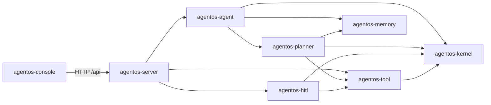

# AgentOS 功能总结

> 基于根 `ReadMe.md` 以及 `agentos-kernel`、`agentos-agent`、`agentos-planner`、`agentos-tool`、`agentos-memory`、`agentos-hitl`、`agentos-server`、`agentos-console` 各模块 `ReadMe.md` 梳理。

## 1. 项目定位

AgentOS 是一个基于 **Java 21 + Maven + Spring Boot** 的多模块 Agent 运行时骨架。

- 领域模块（kernel / agent / planner / tool / memory / hitl）保持为**纯 Java**，不依赖 Spring。
- Spring 仅在 `agentos-server` 中承担装配和对外服务职责。
- 前端 `agentos-console` 是基于 **Vue 3 + Vite** 的独立模块，通过 HTTP API 与后端通信。

模块依赖图：



## 2. 已实现功能（按模块）

### 2.1 agentos-kernel（运行内核）

- 定义 Agent 调用所需的不可变上下文与状态：
  - `AgentRequest`：会话 ID、用户目标、自定义属性。
  - `AgentContext`：team / user / agent / task 身份。
  - `AgentState`：状态、迭代次数、输出、错误、更新时间。
  - `AgentExecutionLimits`：重规划、步骤、工具、模型调用的累计预算。
- 提供函数式 `AgentLoop` 与统一入口 `AgentRuntime`。
- 状态机：`READY / RUNNING / COMPLETED / FAILED`，并预留 `WAITING_APPROVAL`、`CANCELLED`。
- 对同一 `sessionId` 的调用做串行状态更新。
- 不依赖任何其他 AgentOS 业务模块。

### 2.2 agentos-agent（主 Agent 编排）

- 业务编排层：在运行预算内循环 `规划 → 工具 → 重新规划`。
- `MainAgent` 串联：
  - `AgentPlanner.createPlan`
  - `PlanExecutor.execute`
  - `AgentPlanner.replan(PlanExecutionSnapshot)`
  - `AgentFinalizer.finishStreaming(EXECUTION / COMPLETE)`
  - `MemoryService.capture(CompletedTurn.success)`
- 触发重规划的四种场景：`DISCOVERY_COMPLETED`、`RECOVERABLE_FAILURE`、`INVALID_ASSUMPTION`、`EXECUTION_COMPLETED`。
- `Finalizer` 是 Runtime 内部控制动作，不注册成工具；生产装配会额外调用一次文本模型，并将其 SSE 增量直接下发，该调用受模型预算约束。
- 记忆写入 fail-open：只有成功运行才会写 `CompletedTurn`；记忆失败不会让成功运行变成失败。
- 工具 Observation 写入记忆前按“单条 20,000 字符 / 总计 100,000 字符”截断，优先保留最新结果。

### 2.3 agentos-planner（规划器）

- 领域模型：`AgentPlanner`、`LlmAgentPlanner`、`AgentPlan`、`PlanType / PlanOrigin / PlanOutcome`、`PlanStep`、`Observation`、`ObservationSummarizer`、`PlanExecutionSnapshot`、`AgentDecision`、`PlanExecutor`、`FailureClassifier`。
- 计划类型与生命周期：
  - `type`：`DISCOVERY`（探索）或 `EXECUTION`（执行，包含最终回答阶段）。
  - `origin`：`INITIAL` 或 `REPLANNED`，由 Runtime 注入，不进入模型 Schema。
  - `outcome`：`CONTINUE` 携带步骤；`COMPLETE` 必须是非空 `finalAnswer` 且不能带步骤。
- 模型响应使用独立 `ModelPlan` DTO，只包含 `type / outcome / objective / steps / finalAnswer`。
- 失败分类：
  - `TRANSIENT`：必选步骤重试一次失败后重规划，可选步骤失败后跳过。
  - `NOT_FOUND`：以 `INVALID_ASSUMPTION` 重规划，或跳过。
  - `INVALID_ARGUMENT`：以 `RECOVERABLE_FAILURE` 重规划，或跳过。
  - `ACCESS_DENIED / PERMISSION_DENIED / SECURITY_DENIED / TOOL_INTERNAL_ERROR / UNKNOWN`：终止。
- 校验和预算：
  - `PlanValidator` 默认每份计划最多 10 步，校验工具存在性、必填参数、参数类型和未知参数。
  - `DISCOVERY` 只允许低风险工具。
  - `AgentExecutionLimits`：最多 3 次重规划、30 个累计步骤、30 次工具调用、6 次模型调用。
  - 每次发给模型的 `maxSteps` = 单计划上限 ∩ 剩余累计步骤预算。
- `ObservationSummarizer` 确定性摘要工具结果（默认单条 4,000 字符、累计 24,000 字符，优先保留最新）。

### 2.4 agentos-tool（工具协议）

- 包结构：`api` 为公开协议，`runtime` 为统一调度，`builtin` 为默认工具实现；ArchUnit 自动校验依赖方向。
- 核心类型：`AgentTool`、`ToolParameter / ToolDefinition`、`ToolCall`、`ToolResult`、`ToolRegistry`、`ToolDispatcher`、`FileAccessPolicy`、`PagedFileReader / PagedReadResult`。
- 内置工具：
  - `directory_list`：有界列目录（深度默认 2 / 最大 5，条目默认 200 / 最大 500，不跟随符号链接）。
  - `file_search`：`NAME` glob 或 `CONTENT` 字面量搜索（深度默认 8 / 最大 12，结果默认 100 / 最大 500，最多扫描 20,000 个文件；内容搜索跳过符号链接 / 二进制 / 不可读 / > 1 MiB 文件，并返回带行号的匹配）。
  - `file_read`：文本和 PDF 物理页 + 页内偏移分页读取，返回 `totalPages / hasMore / nextPage / nextOffset / truncated`，必须续读到 `hasMore=false`。
  - `echo`：仅用于调用链测试，不承担最终回答。
  - `weather`：查询外部天气接口。
- 文件路径授权由 `FileAccessPolicy` 统一抽象；服务端装配 `RootedFileAccessPolicy`，阻止路径遍历和符号链接逃逸。
- 结构化失败类型：`INVALID_ARGUMENT / NOT_FOUND / TRANSIENT / ACCESS_DENIED / PERMISSION_DENIED / SECURITY_DENIED / TOOL_INTERNAL_ERROR / UNKNOWN`，`UNKNOWN` 默认终止。

### 2.5 agentos-memory（记忆系统）

- 统一门面 `MemoryService`，隔离上层 Agent 与具体存储。
- 统一 `MemoryStore` 端口，内置 JVM 内存、版本化二进制文件和 JDBC/SQLite 实现。
- L0–L3 分层：
  - **L0 成功轮次快照**：已实现，保存请求目标、最终回答和成功工具结果的有界摘要。
  - **L1 原子记忆抽取**：部分实现，使用规则模型（`RuleBasedMemoryModel`）。
  - **L2 场景记忆**：基础版本已实现。
  - **L3 用户画像**：基础版本已实现。
- 检索：`HybridMemoryRetriever` 提供 **BM25 + 可替换向量 + RRF**；默认 Hashing，也可使用真实 OpenAI-compatible Embedding。
- 流水线：`MemoryPipeline` 提供 L0→L1→L2→L3 异步处理、重试、恢复基础版本。
- 模型：默认规则加工，也可使用真实 OpenAI-compatible LLM 完成 L1-L3。
- 持久化：支持本地二进制文件及带迁移、索引和事务的 SQLite。
- 与 Agent 集成：规划前召回 / 成功后写入已接入。
- HTTP 查询：`agentos-server` 的 `MemoryController` 提供按作用域（session / team / user / agent）查看 L0–L3 数据的只读接口（尚无鉴权与写接口）。

### 2.6 agentos-hitl（人在回路）

- `RiskPolicy` 根据工具声明的风险等级与审批阈值判断是否需要审批（例如阈值 `MEDIUM` 时：`LOW` 不审、`MEDIUM / HIGH` 必审）。
- `ApprovalService` 创建 `ApprovalRequest`（会话、Agent、工具说明、调用参数、请求时间）并交给 `ApprovalHandler` 获取布尔结果。
- 调用流程：
  ```text
  PlanExecutor → ToolDispatcher → ApprovalToolInterceptor
    无需审批或已批准 ──► AgentTool.execute
    需要审批 ──► PendingAction(HUMAN_APPROVAL)
  ```
- 默认安全策略：`agentos-server` 将审批阈值设为 `MEDIUM`，使用默认拒绝型 `ApprovalHandler`，因此低风险工具可执行，中高风险工具在接入真实审批渠道前保持阻断。
- 生产可替换：实现自定义 `ApprovalHandler` 接入管理后台、IM 或工作流系统；后续可扩展为持久化审批单 + 异步恢复。

### 2.7 agentos-server（Spring Boot 服务）

- 启动 Spring Boot Web 应用并装配所有模块为 Bean。
- 核心类型：`AgentOsApplication`、`AgentOsConfiguration`、`LlmPlannerConfiguration`、`AgentController`、`MemoryController`、`AgentExceptionHandler`、`AgentRuntimeIntegrationTest`。
- 默认装配：`AgentRuntime → MainAgent → AgentPlanner(LlmAgentPlanner + ModelClient) / PlanExecutor(FailureClassifier / ToolDispatcher(ToolRegistry + ApprovalToolInterceptor)) / AgentFinalizer / MemoryService(MemoryStore + MemoryModel + MemoryEmbedding)`。
- 对外 HTTP API：
  - `POST /api/agents/runs`：创建一次运行。
  - `GET  /api/agents/{sessionId}/state`：查询会话状态（不存在返回 404）。
  - `POST /api/agents/runs/stream`：流式运行（SSE），依次发送阶段事件、上游模型 `output_delta`、`run_completed` 和最终 `state`；不对完整回答做定长二次切片。
  - `POST /api/agent-runs`：可恢复的后台运行，返回 `202 Accepted` + `runId`。
  - `GET  /api/agent-runs/{runId}`：查询运行快照。
  - `GET  /api/agent-runs/{runId}/events?after=N`：按序号补播遗漏事件（事件 SSE `id` 与单调递增 `sequence` 一致）。
  - `POST /api/agent-runs/{runId}/cancel`：显式取消。
  - `GET  /api/memories?sessionId=...&teamId=...&userId=...&agentId=...&recentLimit=...`：查询 L0–L3 记忆快照（只读，不等待异步生成）。
- 异常处理：非法参数被转换为标准 HTTP Problem Detail 400。
- 打包：可执行 JAR `agentos-server/target/agentos-server-0.0.1-SNAPSHOT.jar`。

### 2.8 agentos-console（Vue 3 控制台）

- 技术栈：Vue 3 Composition API + JavaScript + Vite + 原生 Fetch + 原生 CSS 响应式布局。
- 主要职责：
  - 创建 / 切换 Agent 会话。
  - 调用 `POST /api/agent-runs` 创建后台任务，并通过 GET SSE 按事件游标持续订阅。
  - 页面刷新后按 `runId` 查询快照、补播缺失事件并恢复实时展示。
  - 实时展示 Plan / Tool / Observation / Decision / 最终输出 / 失败信息。
  - 可视化 MainAgent → Planner → Tool → Observation → Decision 执行管线。
  - 从服务端分页加载会话，`localStorage` 仅缓存最近 20 个会话用于快速恢复和断网兜底。
  - 本地缓存缺失时，从服务端领域事件恢复完整的用户/助手对话轮次。
  - 顶部提供中英文全局切换，桌面端使用双段按钮，移动端压缩为单按钮。
  - 展示当前 HITL 风险门禁策略。
- 目录结构：`src/components`（SystemHeader / SessionRail / CommandDeck / TranscriptPanel / TelemetryRail）、`src/composables/useAgentConsole.js`、`src/services/agentApi.js`、`App.vue`、`main.js`、`styles.css`。
- 开发：Vite 将 `/api` 代理到 `http://localhost:8080`；生产构建产物在 `agentos-console/dist`。
- 数据边界：浏览器中的会话缓存只用于快速展示，不等同于后端 `MemoryService`；清理站点数据不会删除服务端会话与领域事件，但未提交的新会话草稿会丢失。

## 3. 核心特性概览

1. **迭代式规划与重规划**：探索新事实或遇到可恢复失败时携带 `PlanExecutionSnapshot` 再次调用规划器。
2. **结构化失败处理**：工具失败按 `ToolFailureType` 分类，明确重试 / 跳过 / 重规划 / 终止。
3. **可恢复后台运行**：SSE 事件带单调 `sequence`，断开连接不取消任务；支持按游标补播。
4. **风险门禁机制**：默认拒绝中高风险工具，待接入真实审批渠道。
5. **全链路流式输出**：前端实时展示 Planner / Tool / Observation / Decision，并逐个消费供应商模型 SSE 增量。
6. **记忆分层 L0–L3**：成功轮次快照 / 原子记忆 / 场景 / 用户画像，BM25 + 可替换向量 + RRF 混合检索。
7. **PDF 物理分页读取**：返回完整续读元数据，强制按 `nextPage / nextOffset` 续读到 `hasMore=false`。
8. **可替换路径授权**：`FileAccessPolicy` 抽象便于接入 sandbox。
9. **执行预算保护**：单次运行的步骤 / 工具 / 模型调用 / 重规划次数全部有上限。
10. **跨模块集成测试**：`AgentRuntimeIntegrationTest` 验证规划 → 工具 → 状态 → 记忆完整链路。

## 4. 构建与运行

```bash
# 测试 + 打包
mvn clean test
mvn -pl agentos-server -am package

# 启动后端
mvn -pl agentos-server -am spring-boot:run
# 或直接运行 JAR
java -jar agentos-server/target/agentos-server-0.0.1-SNAPSHOT.jar

# 启动前端
cd agentos-console
npm install
npm run dev   # 开发：http://localhost:5173
npm run build # 生产构建，产物 dist/
```

模型参数统一配置在 `agentos-server/src/main/resources/application.yml`，可用 `AGENTOS_MODEL_API_KEY` 等环境变量覆盖。默认启用 `LlmAgentPlanner` 和 OpenAI-compatible `ModelClient`。

## 5. 常用 API 一览

```bash
# 创建一次运行
curl -X POST http://localhost:8080/api/agents/runs \
  -H "Content-Type: application/json" \
  -d '{"sessionId":"session-1","input":"hello agentos"}'

# 流式运行
curl -N -X POST http://localhost:8080/api/agents/runs/stream \
  -H "Content-Type: application/json" \
  -H "Accept: text/event-stream" \
  -d '{"sessionId":"session-1","input":"hello agentos"}'

# 查询会话状态
curl http://localhost:8080/api/agents/session-1/state

# 后台运行（控制台默认使用）
curl -X POST http://localhost:8080/api/agent-runs \
  -H "Content-Type: application/json" \
  -d '{"sessionId":"session-1","input":"阅读当前项目并总结功能"}'
# 响应：{ "runId": "..." } (HTTP 202)

# 补播事件
curl 'http://localhost:8080/api/agent-runs/<runId>/events?after=42'

# 取消
curl -X POST http://localhost:8080/api/agent-runs/<runId>/cancel

# 记忆快照
curl 'http://localhost:8080/api/memories?sessionId=session-1&recentLimit=20'
```

## 6. 待完善 / 未实现项

- `agentos-memory` 中的 Skill 创建与管理、LLM-Wiki 文档解析 / FTS5 / 知识图谱、CodeGraph 仓库索引、`/v3/tools/*` 服务化接口、Team / User / Agent / Task / Asset 管理、ACL、SDK 适配层与生产部署体系等仍**未实现**。
- `agentos-memory` 已具备真实 LLM/Embedding 适配、SQLite 和阶段一回归测试；生产前仍需真实供应商质量评测、目标硬件压测、备份恢复及多节点方案。
- `agentos-hitl` 默认仍为拒绝型 `ApprovalHandler`，需要接入真实审批渠道才能放行中高风险工具。
- `agentos-tool` 文件路径由 `RootedFileAccessPolicy` 限制在配置根目录；宿主机进程工具需保持关闭或另行隔离。
