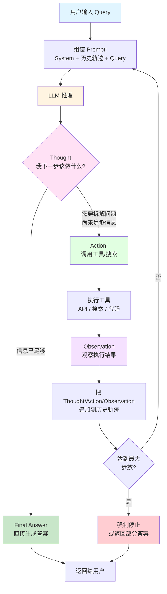
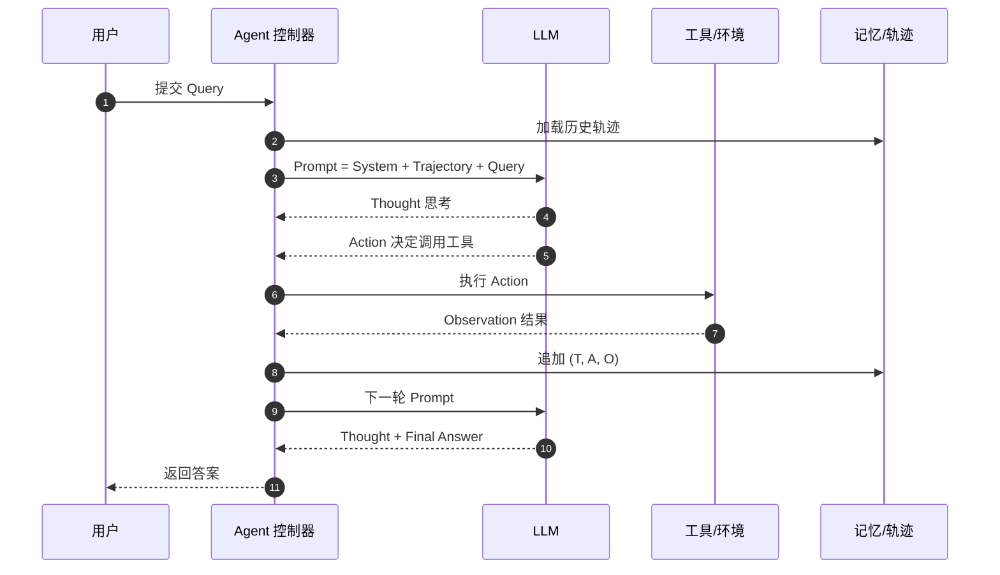
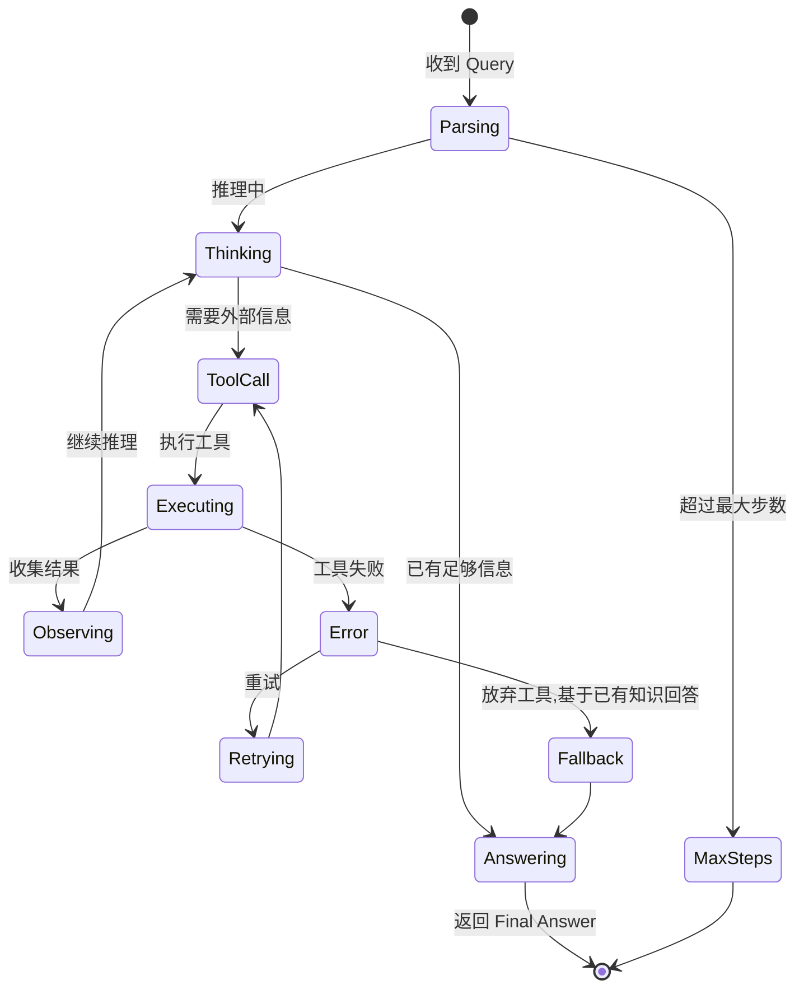

# ReAct:大模型"思考—行动—观察"范式

## 是什么

ReAct(Reasoning + Acting)由 Yao et al. 在论文 *ReAct: Synergizing Reasoning and Acting in Language Models*(ICLR 2023)提出。核心思想:

> 让 LLM 在完成任务时,交替进行**显式推理**(Thought)和**外部动作**(Action),并把动作的**观察结果**(Observation)再喂回模型,形成"思考 → 行动 → 观察"的循环,直到给出最终答案。

它把 Chain-of-Thought(只思考)和 Action-Only(只行动)两者的优点结合起来,既缓解了幻觉,又能与外部世界(工具、知识库、API)交互。

---

## 核心三要素

| 步骤 | 含义 | 示例 |
|---|---|---|
| **Thought (Tₖ)** | LLM 显式推理:"现在处于什么状态、要不要调用工具、调哪一个、参数是什么" | *"我需要查一下北京今天的气温,应该调用天气 API"* |
| **Action (Aₖ)** | 执行一个外部动作,通常是工具调用(搜索、计算、代码执行、数据库查询等) | `Action: search_weather(city="北京")` |
| **Observation (Oₖ)** | 动作返回的原始结果,作为下一轮 Thought 的输入 | `Observation: {"temp": 28, "weather": "晴"}` |

---

## 主流程图



---

## 单轮时序图



---

## 轨迹(Trajectory)结构

LLM 看到的是一串"思考—行动—观察"的轨迹,Prompt 模板大致长这样:

```
System: 你是一个可以使用工具的助手。可用工具: search, calculator, code_exec ...

User: 北京今天适合穿短袖吗?

Thought 1: 用户想知道北京今天适合穿短袖的穿衣建议,
            我需要先知道北京今天的天气和气温。
Action 1: search_weather
Action Input 1: {"city": "北京"}
Observation 1: {"temp": 28, "humidity": 60, "weather": "晴"}

Thought 2: 现在我已知道北京今天 28 度、湿度 60%、晴天,
            我可以给出穿衣建议了。
Action 2: Finish
Action Input 2: {"answer": "北京今天 28°C 晴,适合穿短袖..."}
Observation 2: Task completed.
```

---

## 决策状态机



---

## 关键设计要点

### 1. Prompt 工程
- **明确格式**:在 System Prompt 中给 LLM 演示 `Thought/Action/Observation` 的样例(Few-shot),约束它按格式输出。
- **工具描述**:每个工具要有清晰的 `name / description / parameters / 何时使用`。
- **何时停止**:必须有 `Finish` 类的终止动作,否则 LLM 容易无限循环。

### 2. 解析与控制
- LLM 输出是**自由文本**,需要用**正则 / JSON Schema / Function Calling** 解析出 `Action` 和 `Action Input`。
- 解析失败 → 让 LLM 重试或走兜底分支。

### 3. 步数上限 & 成本
- 一定要设置 `max_iterations`(常见 5–15 步)。
- 每步都要计费,长链路累积 token 成本可观。

### 4. 记忆管理
- **短期**:当前任务的轨迹。
- **长期**:向量数据库 / 知识库,跨任务持久化。
- 历史过长时要**裁剪 / 摘要**,避免超上下文。

### 5. 错误与重试
- 工具超时、解析失败、模型返回不合法 Action —— 都要有**重试 + 兜底**策略。
- 不要把异常 Observation 直接喂回去,要包装成结构化错误提示。

| 范式 | 特点 |
|---|---|
| **ReAct** | 思考与行动交织,逐步推进 |
| **ReWOO** | 先离线规划完整计划,再一次性执行所有动作,节省 token |
| **Reflexion** | ReAct + 失败后自我反思,把反思写入记忆 |
| **Plan-and-Execute** | Planner 一次性出计划,Executor 按部就班执行 |
| **Function Calling** | 用结构化 `tool_calls` 替代自由文本解析,工业界主流 |

---

## 最小实现(Python 伪代码)

```python
def react_loop(query, tools, llm, max_steps=8):
    trajectory = []
    for step in range(max_steps):
        prompt = render_prompt(system, trajectory, query)
        output = llm(prompt)                  # 自由文本输出
        thought, action, action_input = parse(output)

        trajectory.append({"thought": thought, "action": action})

        if action == "Finish":
            return action_input["answer"]

        observation = tools[action](**action_input)
        trajectory.append({"observation": observation})

    return "未能完成,已用尽步数。"
```

工业界一般用 LangChain、LangGraph、LlamaIndex、AutoGen 等框架实现,核心就是这个循环。

---

## 适用 vs 不适用

| 适合 ReAct | 不太适合 ReAct |
|---|---|
| 需要**外部实时信息**(搜索、天气、股票) | 纯创意 / 写作任务 |
| 需要**精确计算**(代码执行、SQL) | 单轮简单问答 |
| 多步骤、需要中间反馈的任务 | 超长链任务(应改用分层 Agent) |
| 工具丰富、能拆解为子动作 | 工具极少、动作空间小 |

---

## 参考

- Yao et al., *ReAct: Synergizing Reasoning and Acting in Language Models*, ICLR 2023
- Shunyu Yao, *The Rise and Potential of Large Language Model Agents*, 2023
- LangChain / LangGraph ReAct Agent 文档
- OpenAI Function Calling 文档
